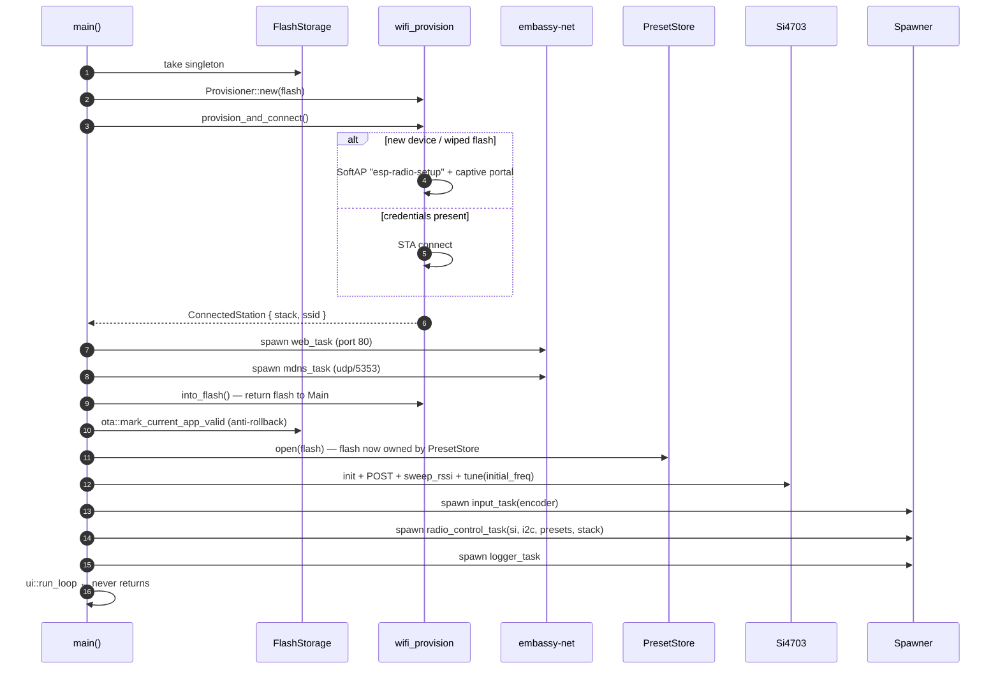

# Architecture

This document is the **map** of `esp-radio` — what runs where, who
talks to whom, and which invariants hold. Read it once before changing
anything that touches more than a single file; the per-module rustdoc
covers the *how*, this file covers the *why* and the *layout*.

> Scope: the `radio` binary at [`src/bin/radio/`](./src/bin/radio).
> The reusable drivers (`si4703`, `display`, `rotary_encoder`,
> `wifi_provision`) live under [`src/`](./src) and are documented in
> their own module headers.

---

## 1. Runtime topology

```mermaid
flowchart LR
  %% ─── Hardware lane ───────────────────────────────────────────────
  subgraph HW [Hardware]
    direction TB
    SI[Si4703 FM tuner<br/>I²C0]
    LCD[ST7789 LCD<br/>SPI2]
    ENC[KY-040 encoder<br/>PCNT0]
    FLASH[(SPI flash<br/>4 MB)]
    WIFI[WiFi/BLE radio]
  end

  %% ─── Tasks lane ──────────────────────────────────────────────────
  subgraph TASKS [Embassy tasks]
    direction TB
    INPUT[input_task<br/>tasks.rs]
    RADIO[radio_control_task<br/>tasks.rs]
    LOGGER[logger_task<br/>tasks.rs]
    WEB[web_task<br/>web.rs]
    MDNS[mdns_task<br/>mdns.rs]
    UI[ui::run_loop<br/>main thread]
  end

  %% ─── Shared state lane ───────────────────────────────────────────
  subgraph SHARED [Shared state - state.rs]
    direction TB
    INCMD([INPUT_CMDS<br/>Channel&lt;RadioCommand,8&gt;])
    OTACMD([OTA_CMDS<br/>Signal&lt;OtaCommand&gt;])
    STATE[(RADIO_STATE<br/>Mutex&lt;RadioState&gt;)]
    LOG[(LISTENING_LOG<br/>Mutex&lt;LogBuffer&gt;)]
  end

  %% Hardware → tasks
  ENC -->|rotary deltas + button| INPUT
  SI <-->|tune / read RDS / RSSI| RADIO
  FLASH <-->|presets + OTA| RADIO
  LCD <-- frame --- UI
  WIFI <-->|TCP / UDP / mDNS| WEB
  WIFI <--> MDNS

  %% Tasks ↔ shared state
  INPUT -->|push cmd| INCMD
  WEB   -->|push cmd| INCMD
  WEB   -->|signal Start url| OTACMD
  INCMD -->|recv| RADIO
  OTACMD -->|wait| RADIO

  RADIO -->|publish_freq / RDS / OTA progress| STATE
  WEB   -->|read snapshot| STATE
  UI    -->|read snapshot| STATE
  LOGGER -->|read snapshot| STATE
  LOGGER -->|append entry| LOG
  WEB    -->|read entries| LOG
```

Five Embassy tasks plus the main thread's UI loop. No locks are held
across `.await`; all cross-task traffic flows through the four shared
primitives in `state.rs`.

---

## 2. Tasks at a glance

| Task | File | Role | Inputs | Outputs |
| --- | --- | --- | --- | --- |
| `input_task` | [tasks.rs] | Aggregates rotary/button events into `RadioCommand` | PCNT delta, GPIO IRQ | `INPUT_CMDS` |
| `radio_control_task` | [tasks.rs] | Owns the Si4703, flash and the OTA controller. Single writer of most fields in `RADIO_STATE`. | `INPUT_CMDS`, `OTA_CMDS`, RDS group reads | `RADIO_STATE`, flash writes, I²C tune, LCD refresh trigger |
| `logger_task` | [tasks.rs] | Samples `RADIO_STATE` every 10 s, appends a row to the listening-log ring | `RADIO_STATE` | `LISTENING_LOG` |
| `web_task` | [web.rs] | `picoserve` HTTP/1.1 server; renders the SPA and the JSON API | TCP, `RADIO_STATE`, `LISTENING_LOG` | `INPUT_CMDS`, `OTA_CMDS` |
| `mdns_task` | [mdns.rs] | Passive A-record responder on `224.0.0.251:5353` | UDP multicast | UDP unicast reply |
| `ui::run_loop` | [main.rs] | Slint frame loop — reads `RADIO_STATE`, draws to LCD | `RADIO_STATE` | LCD framebuffer |

[tasks.rs]: ./src/bin/radio/tasks.rs
[web.rs]: ./src/bin/radio/web.rs
[mdns.rs]: ./src/bin/radio/mdns.rs
[main.rs]: ./src/bin/radio/main.rs

---

## 3. Shared primitives — what's in `state.rs`

```text
INPUT_CMDS    Channel<CriticalSectionRawMutex, RadioCommand, 8>
OTA_CMDS      Signal <CriticalSectionRawMutex, OtaCommand>
RADIO_STATE   Mutex  <CriticalSectionRawMutex, RadioState>
LISTENING_LOG Mutex  <CriticalSectionRawMutex, LogBuffer>   // listening_log.rs
```

### `RadioCommand` (5 variants)

| Variant | Producer | Effect on radio task |
| --- | --- | --- |
| `TuneRelative(i16)` | encoder rotation, `/api/tune/up` `/api/tune/down` | shift current freq by ±N×0.1 MHz |
| `TuneAbsolute(u16)` | `POST /api/tune` | clamp + jump to MHz×10 |
| `ToggleMute` | encoder ultra-long press, `POST /api/mute` | toggle Si4703 mute bit |
| `SavePreset` | encoder long press, `POST /api/preset/save` | append/overwrite slot, persist to flash |
| `CyclePreset` | encoder short press, `POST /api/preset/cycle` | next saved freq, fall back to seek-up |

### `OtaCommand` (single variant `Start(String)`)

Posted by `POST /api/ota`. The radio task pauses the preset store,
takes the flash handle, runs the HTTP downloader through `OtaWriter`,
then hands the flash back. See [docs/ota-design.md](./docs/ota-design.md).

### `RadioState` invariants

- **Single writer**: every field is written *only* by `radio_control_task`
  (which also owns the OTA controller). The web task and UI task are
  read-only.
- **Lock discipline**: no `await` between `lock().await` and `drop`.
  Helpers like `publish_freq`, `publish_ota_progress`, `set_status`
  enforce this by structure.
- **`Clone` snapshots**: web/UI take a `RadioState` snapshot
  (`*state` clone) and release the mutex *before* serialising/rendering.

---

## 4. Boot sequence

`main.rs` runs to completion before the executor starts servicing other
tasks; everything below executes in order on the main task:



Ordering rationale:

1. Provisioning **must** happen before the network stack is reachable
   from user code; the SoftAP path also serves the credential form
   itself.
2. Web + mDNS spawn **before** flash is handed to `PresetStore` because
   the provisioner owns the flash up to that point.
3. POST + sweep **before** spawning `radio_control_task` so the user
   sees a populated band scope on the very first frame.

---

## 5. Flash ownership timeline

The `FlashStorage` peripheral is a singleton. There is exactly **one
owner at any given moment**:

```
boot ──► Provisioner ──► (into_flash) ──► PresetStore
                                            │
                              radio_control_task ─┤  (steady state)
                                            │
                              OTA job? ─────┤
                                            │
                                            ▼
                              PresetStore.pause(&mut flash)
                                            │
                              OtaWriter takes &mut flash
                                            │
                              PresetStore.resume()
```

- `PresetStore::pause(&mut flash) -> &mut FlashStorage` lends the
  underlying handle out for the duration of an OTA job. Concurrent
  `flush_last_tuned_if_due` is short-circuited by the
  `RadioState.ota_in_progress` flag (see `state.rs::publish_ota_in_progress`).
- This avoids an `Arc<Mutex<FlashStorage>>` and keeps the steady-state
  path lock-free.

---

## 6. Memory budget (release build, 4 MB flash)

| Region | Size | Use |
| --- | --- | --- |
| `bootloader` | 32 KiB | esp-bootloader-esp-idf |
| `partitions` | 4 KiB | partition table (`partitions.csv`) |
| `otadata` | 8 KiB | active-slot pointer, anti-rollback |
| `ota_0`, `ota_1` | 1.875 MiB each | A/B firmware slots |
| `storage` | 64 KiB | presets + last-tuned + WiFi creds (last sector) |
| `nvs` | residual | esp-radio reserves; not used by app |

Heap (`esp_alloc::heap_allocator!(72 * 1024)`): 72 KiB.
Stack: 32 KiB main, 8 KiB per Embassy task.

---

## 7. Static-cell ownership map

Long-lived `&'static` references are minted via `static_cell::StaticCell`
and `picoserve::make_static!` in **`main.rs` only**. Nothing else
allocates `'static` storage:

| Static | Lifetime | Path |
| --- | --- | --- |
| `STACK_RESOURCES` | whole program | `wifi_provision::provision_and_connect` |
| `app: AppRouter<AppProps>` | whole program | `web_task` setup |
| `config: picoserve::Config` | whole program | `web_task` setup |
| `POST_RESULT` | whole program | `diagnostics::set_post_result` |

A new `'static` should be added with care; the executor's task arena
already accounts for the five tasks listed in §2.

---

## 8. Where to put new features

| You want to… | Touch this | Read first |
| --- | --- | --- |
| Add a button gesture | `tasks::input_task` + new `RadioCommand` | rustdoc on `INPUT_CMDS` |
| Expose a new API endpoint | `web.rs` (route + handler) + `web/index.html` | `picoserve` 0.18 docs |
| Persist a new field across reboots | `presets.rs` (bump `SCHEMA_VERSION`!) | header comment in `presets.rs` |
| Render a new widget | `ui/radio_ui.slint` + `ui::apply_state_to_ui` | `ui.rs` rustdoc |
| Drive a new peripheral | new module under `hardware.rs` | how `init_tuner` is structured |
| Modify OTA flow | `ota/`, `state::OtaCommand`, web `/api/ota` | [docs/ota-design.md](./docs/ota-design.md) |

---

## 9. Build artefacts

| Command | Output |
| --- | --- |
| `cargo make build-release` | `target/.../release/radio` (ELF) |
| `cargo make ota-image` | `target/.../release/radio.bin` (raw image) |
| `cargo make ota-serve` | runs `tools/ota-serve` over the `.bin` with QR |
| `cargo make flash` | probe-rs flash the dev partition table |
| `cargo make ci` | fmt-check + clippy + host-test + release-build (used by CI) |
| `cargo make host-test` | run pure-logic unit tests under `tools/host-tests/` |

Tooling crates live under [`tools/`](./tools); they target the host and
are excluded from the firmware build via `[workspace] exclude`.

---

## 10. Things deliberately not in this doc

- Per-RDS-group decoder behaviour — see [`src/si4703/mod.rs`](./src/si4703/mod.rs).
- Captive-portal HTTP parsing — see [`src/wifi_provision/mod.rs`](./src/wifi_provision/mod.rs).
- OTA wire format & A/B switchover — see [`docs/ota-design.md`](./docs/ota-design.md).
- Slint widget tree — preview with `cargo make ui-preview-data`.

When in doubt, the rustdoc is the source of truth; this file is the
on-ramp.
