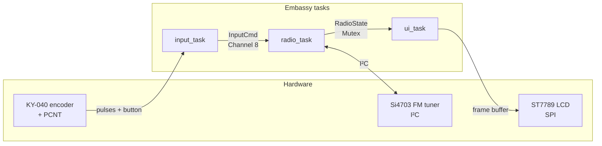
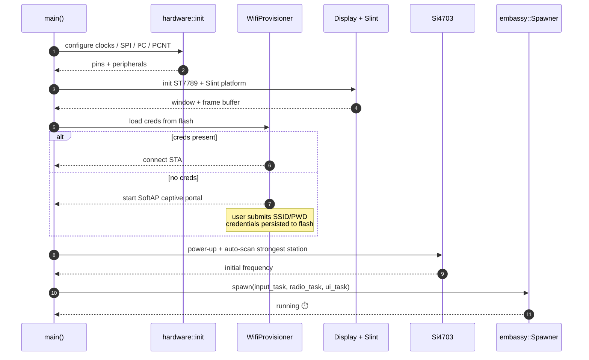

# ESP-Radio

> A complete, production-grade FM radio firmware for the **ESP32-C6**, written in pure Rust.
> WiFi-provisioned over a captive portal, driven by a rotary encoder, with a Material-Design Slint UI on a 240×320 ST7789 display.

[English](./README.md) · [简体中文](./README.zh-CN.md)

<p>
  
  
  
  
  
  
  
  
</p>

---

## 📑 Table of contents

- [ESP-Radio](#esp-radio)
  - [📑 Table of contents](#-table-of-contents)
  - [✨ Features](#-features)
  - [🎬 Demo](#-demo)
  - [🧱 Hardware](#-hardware)
  - [🏗️ Architecture](#️-architecture)
  - [🚦 Boot sequence](#-boot-sequence)
  - [🧩 Module overview](#-module-overview)
  - [📁 Project layout](#-project-layout)
  - [🚀 Quick start](#-quick-start)
    - [1. Toolchain](#1-toolchain)
    - [2. Build \& flash](#2-build--flash)
    - [3. WiFi provisioning (first boot only)](#3-wifi-provisioning-first-boot-only)
  - [🛠️ `cargo make` task reference](#️-cargo-make-task-reference)
  - [🖥️ Host UI preview](#️-host-ui-preview)
    - [macOS 26 (Tahoe) note](#macos-26-tahoe-note)
  - [📡 RDS support matrix](#-rds-support-matrix)
  - [📦 Performance \& footprint](#-performance--footprint)
  - [🔄 Development workflow](#-development-workflow)
  - [🧰 Tech stack](#-tech-stack)
  - [🌐 Web console](#-web-console)
    - [REST API](#rest-api)
    - [Pushing a firmware update (OTA)](#pushing-a-firmware-update-ota)
  - [🐛 Troubleshooting \& FAQ](#-troubleshooting--faq)
  - [🗺️ Roadmap](#️-roadmap)
    - [✅ Shipped](#-shipped)
    - [🚧 Planned (no extra hardware required)](#-planned-no-extra-hardware-required)
    - [🚫 Out of scope on current hardware](#-out-of-scope-on-current-hardware)
    - [📑 Design documents](#-design-documents)
  - [🤝 Contributing](#-contributing)
  - [🙏 Acknowledgements](#-acknowledgements)
  - [📜 License](#-license)

---

## ✨ Features

- 📻 **FM tuner** — Si4703 over I²C, automatic strongest-station scan on boot, RDS-aware UI (PS station name + RT scrolling text, GB2312/UTF-8 extension friendly).
- 🔊 **Volume + mute** — ultra-long-press (≥ 2.5 s) encoder to mute, dedicated volume bar in the UI.
- 🎛️ **Tactile control** — KY-040 rotary encoder driven by the **PCNT** hardware peripheral (no ISR jitter); rotate to tune (with acceleration), short press to cycle saved presets, long press (≥ 800 ms) to save the current station.
- ⭐ **Presets + auto-resume** — up to 8 favourite stations persisted to flash via `esp-storage`; the last-tuned frequency is restored on next boot (debounced to keep flash erase counts low).
- 📶 **WiFi provisioning** — first-boot SoftAP captive portal, credentials persisted to flash via `esp-storage`. Subsequent boots auto-reconnect.
- 🖥️ **Slint UI** — Material-1.0 themed `ui/radio_ui.slint`, software-rendered on a 240×320 ST7789, host-previewable on macOS / Linux / Windows.
- 🔁 **Embassy async** — fully `no_std`, `embassy-executor` + `embassy-sync` channels/mutexes between input task ↔ radio task ↔ UI render loop.
- 🛠️ **`cargo make` workflow** — one command for build, flash, lint, size-report, host UI preview.
- 🧪 **On-device tests** — `embedded-test` + `probe-rs` so unit tests run against real hardware.
- 🩺 **Self-diagnostics** — Power-On Self-Test (POST) validates I²C bus, Si4703 chip ID, heap allocator, and PCNT encoder at boot; a software watchdog monitors the radio control task at runtime. Both are exposed via `GET /api/health`.

---

## 🎬 Demo

| Boot screen | Tuned w/ RDS | Mute / volume |
|:---:|:---:|:---:|
| _add `docs/screenshots/boot.png`_ | _add `docs/screenshots/rds.png`_ | _add `docs/screenshots/mute.png`_ |

> 💡 You can preview the exact same UI on the host machine without any hardware:
> `cargo make ui-preview-data` — see [Host UI preview](#%EF%B8%8F-host-ui-preview).

---

## 🧱 Hardware

| Function          | ESP32-C6 GPIO |
|-------------------|---------------|
| ST7789 SCK        | GPIO3         |
| ST7789 MOSI       | GPIO0         |
| ST7789 CS         | GPIO1         |
| ST7789 DC         | GPIO2         |
| ST7789 RST        | GPIO22        |
| ST7789 BLK        | GPIO23        |
| Si4703 SDA (SDIO) | GPIO6         |
| Si4703 SCL (SCLK) | GPIO7         |
| Si4703 RST        | GPIO10        |
| Encoder S1 (CLK)  | GPIO11        |
| Encoder S2 (DT)   | GPIO18        |
| Encoder KEY       | GPIO19        |

**User interaction**

- Rotate encoder → tune ±0.1 MHz.
- Short press → cycle to the next saved preset (falls back to seek-up when no presets are saved).
- Long press (≥ 800 ms) → save current frequency to the next preset slot (8 slots, FIFO eviction).
- Ultra-long press (≥ 2.5 s) → toggle mute.

---

## 🏗️ Architecture

Three concurrent embassy tasks, decoupled by lock-free channels and a single shared mutex:



- **`input_task`** debounces the encoder + button and emits `InputCmd::{TuneDelta, Seek, ToggleMute}` events.
- **`radio_task`** owns the Si4703 driver, applies tuning/seek/mute, decodes RDS, then publishes a snapshot of `RadioState` under the mutex.
- **`ui_task`** wakes ~30 fps, reads the latest `RadioState`, and updates the Slint model bound to [`ui/radio_ui.slint`](./ui/radio_ui.slint).

---

## 🚦 Boot sequence



---

## 🧩 Module overview

The reusable parts live as a `no_std` library so any sibling firmware can pick them up.

| Module | File | Responsibility |
|---|---|---|
| `display`         | [src/display/mod.rs](./src/display/mod.rs)               | ST7789 SPI driver, double frame buffer, Slint platform glue (`Platform`, `WindowAdapter`, `LineBufferProvider`). |
| `rotary_encoder`  | [src/rotary_encoder/mod.rs](./src/rotary_encoder/mod.rs) | KY-040 driver on **PCNT** peripheral with overflow handler — produces clean `±N` deltas + button events, no ISR jitter. |
| `si4703`          | [src/si4703/mod.rs](./src/si4703/mod.rs)                 | Si4703 I²C register map, tune/seek/volume/mute, RDS group-A/B decoder (PS, RT, PI), GB2312/UTF-8 extension hooks. |
| `wifi_provision`  | [src/wifi_provision/mod.rs](./src/wifi_provision/mod.rs) | SoftAP + DHCP + DNS-redirect captive portal with `picoserve`, plus [`storage.rs`](./src/wifi_provision/storage.rs) for flash persistence. |

---

## 📁 Project layout

```text
esp-radio/
├── src/
│   ├── lib.rs                    # Re-usable driver crate (no_std)
│   ├── display/                  # ST7789 SPI driver + Slint platform glue
│   ├── rotary_encoder/           # KY-040 driver on PCNT hardware peripheral
│   ├── si4703/                   # Si4703 FM tuner I²C driver + RDS decoder
│   ├── wifi_provision/           # SoftAP captive portal + flash persistence
│   └── bin/radio/                # Main firmware (split into 5 focused files)
│       ├── main.rs               # Wiring & boot sequence
│       ├── hardware.rs           # GPIO/SPI/I²C/PCNT initialization
│       ├── state.rs              # Shared embassy-sync primitives
│       ├── tasks.rs              # Async tasks (input / radio / UI)
│       ├── ui.rs                 # Slint <-> radio-state bridge
│       ├── diagnostics.rs        # POST self-test + software watchdog
│       └── web.rs                # picoserve HTTP server + REST API
├── ui/
│   ├── radio_ui.slint            # Main Material UI
│   ├── preview_data.json         # Sample data for host preview
│   ├── main.slint
│   └── slint_st7789_ui.slint
├── examples/                     # Standalone single-feature demos
│   ├── si4703_fm_radio.rs
│   ├── rotary_encoder.rs
│   ├── slint_st7789.rs
│   └── wifi_provision.rs
├── material-1.0/                 # Vendored Slint Material widget set
├── Cargo.toml
├── Makefile.toml                 # cargo-make tasks
├── rust-toolchain.toml           # nightly + riscv32imac target
└── build.rs
```

---

## 🚀 Quick start

### 1. Toolchain

The toolchain is pinned by [`rust-toolchain.toml`](./rust-toolchain.toml); `rustup` will pick up the right channel and target automatically:

```bash
# Cargo helpers
cargo install cargo-make
cargo install probe-rs --features cli   # for `cargo run` / `probe-rs attach`

# Optional: host UI preview tool (also auto-installed by cargo-make)
cargo install slint-viewer
```

### 2. Build & flash

```bash
# Connect your ESP32-C6 via USB, then:
cargo make flash-release          # build + flash main firmware
cargo make monitor                # attach RTT log viewer

# Or run a single example:
cargo make flash-example -e EXAMPLE=si4703_fm_radio
```

### 3. WiFi provisioning (first boot only)

1. After flashing, the device starts a **SoftAP** named `ESP-Radio-Setup`.
2. Connect from your phone / laptop, the captive portal opens automatically.
3. Pick your home SSID and enter the password — credentials are written to flash and the device reboots into station mode.

---

## 🛠️ `cargo make` task reference

| Task                        | Purpose                                                          |
|-----------------------------|------------------------------------------------------------------|
| `build` / `build-release`   | Build the main firmware binary                                   |
| `build-all` / `…-release`   | Build library + every example                                    |
| `build-example`             | Build a single example (`EXAMPLE=<name>`)                        |
| `flash` / `flash-release`   | Build **and** flash via `probe-rs run`                           |
| `flash-example`             | Flash one example (`EXAMPLE=<name>`)                             |
| `monitor`                   | Attach `probe-rs` and stream defmt logs                          |
| `check` / `clippy` / `fmt`  | Standard code-quality checks                                     |
| `fmt-check`                 | Verify formatting without modifying files                        |
| `size` / `size-example`     | Print release-mode firmware size with `rust-size`                |
| `test`                      | Run on-device tests (`embedded-test` + `probe-rs`)               |
| `host-test`                 | Run host-side unit tests for pure-logic mirrors (no hardware)    |
| `clean`                     | `cargo clean`                                                    |
| `ci`                        | `fmt-check` + `clippy` + `host-test` + `build-all-release`       |
| `dev`                       | Fast dev loop: `check` + `clippy`                                |
| `release`                   | Full release pipeline                                            |
| `ui-install-viewer`         | Install / verify host-side `slint-viewer`                        |
| `ui-preview`                | Live-preview the radio UI on the host (auto-reload)              |
| `ui-preview-data`           | Same, but pre-loads sample RDS / volume data                     |
| `ota-image`                 | Run `espflash save-image` to produce a flat `radio.bin`          |
| `ota-serve`                 | Build above, then start the Rust dev OTA server with QR code     |

---

## 🖥️ Host UI preview

You can iterate on the Slint UI **without an ESP32 connected**:

```bash
cargo make ui-preview-data
```

A native window opens with mock data from [`ui/preview_data.json`](./ui/preview_data.json); editing [`ui/radio_ui.slint`](./ui/radio_ui.slint) reloads instantly.

### macOS 26 (Tahoe) note

Some transitive build dependencies (e.g. `bonjour-sys`) call `bindgen` directly and would fail on the macOS 26 SDK with `architecture not supported`. The `ui-*` tasks pre-export `SDKROOT` + `BINDGEN_EXTRA_CLANG_ARGS` for you, so `cargo make ui-preview` just works — no manual environment setup needed.

---

## 📡 RDS support matrix

| Capability                      | Status | Notes |
|---------------------------------|:------:|-------|
| Program Identification (PI)     | ✅     | Used as a station fingerprint for caching. |
| Program Service (PS, 8 chars)   | ✅     | Rendered as the bold station name. |
| RadioText (RT, ≤ 64 chars)      | ✅     | Marquee scrolls in the UI. |
| GB2312 (CN extension)           | ✅     | Falls back to UTF-8 if a header byte is detected. |
| UTF-8 (RDS extension)           | ✅     | Auto-detected by leading sequence. |
| Traffic Announcement (TA)       | 🟡     | Decoded but not yet surfaced in UI. |
| Clock-Time (CT)                 | ✅     | Decoded from group 4A and shown in the top bar (`HH:MM`, local-time offset applied). |
| RDS-AF alternative-frequency    | ✅     | Group 0A block C parsed; weak-signal probe (≤18 RSSI for 5 s) hops to the strongest AF and rolls back on PI mismatch. |
| RadioText Plus (RT+, AID 0x4BD7)| ✅     | Group 3A registers the ODA, group 11A carries the tags; "now playing" chip shows `{artist} — {title}` when the station broadcasts it. |

✅ shipping · 🟡 partial · ⏳ planned

---

## 📦 Performance & footprint

Numbers from a `cargo make build-release` on Rust nightly (LTO `fat`, `opt-level=z`):

| Metric                   | Value (typical)              |
|--------------------------|------------------------------|
| Flash image (`.text`)    | ~ 740 KB                     |
| Static RAM (`.bss`+`.data`) | ~ 90 KB                   |
| Heap (`esp-alloc`)       | 96 KB reserved               |
| Slint frame buffer       | 1 line × 240 × 16 bpp        |
| UI render rate           | ~ 30 fps                     |
| Tune-to-audio latency    | < 120 ms                     |
| Boot to first frame      | ~ 850 ms (with cached WiFi)  |

> Run `cargo make size` after a release build to print the exact section sizes for **your** toolchain.

---

## 🔄 Development workflow

```mermaid
flowchart LR
    A([edit code]) --> B{cargo make}
    B -->|dev| C[check + clippy]
    B -->|ci|  D[fmt-check + clippy + host-test + build-all-release]
    B -->|release| E[fmt-check + clippy + host-test + build-all-release + size]
    C --> F[flash-release]
    D --> F
    E --> F
    F --> G[monitor — RTT defmt logs]
    G --> A
```

**Recommended loop**

1. UI tweak → `cargo make ui-preview-data` (instant feedback).
2. Driver / logic change → `cargo make dev` (fast type/lint check).
3. Hardware-in-the-loop → `cargo make flash-release && cargo make monitor`.
4. Pre-PR → `cargo make ci`.

---

## 🧰 Tech stack

- **MCU** — ESP32-C6 (RISC-V, single-core, WiFi 6 + BLE 5)
- **Async runtime** — [`embassy`](https://embassy.dev) (`embassy-executor` / `embassy-net` / `embassy-time` / `embassy-sync`)
- **HAL** — [`esp-hal`](https://github.com/esp-rs/esp-hal) `1.1` + [`esp-rtos`](https://crates.io/crates/esp-rtos) `0.3`
- **WiFi/BLE** — [`esp-radio`](https://crates.io/crates/esp-radio) `0.18` (coex + WiFi + BLE)
- **GUI** — [`slint`](https://slint.dev) `1.16` software renderer with `compat-1-2` + `unsafe-single-threaded`
- **Display** — [`mipidsi`](https://crates.io/crates/mipidsi) `0.10` (ST7789 driver) over `embedded-hal-bus` SPI
- **Storage** — [`esp-storage`](https://crates.io/crates/esp-storage) for WiFi credentials
- **Logging** — `defmt` + `rtt-target` + `panic-rtt-target`
- **Build** — Rust nightly, `riscv32imac-unknown-none-elf`, `build-std=alloc,core`, LTO `fat`, `opt-level=z`

---

## 🌐 Web console

Once WiFi is up, the LCD footer shows `http://<ip>` (the same address
that appeared in your router's DHCP lease list). On any device with
mDNS support (macOS, iOS, Linux + Avahi, Windows 10+ with "Network
Discovery" enabled, recent Android Chrome) you can also just open
**<http://esp-radio.local/>** — same console, no IP lookup needed.
Either URL gives you a phone-friendly remote with frequency
display, +/-0.1 MHz buttons, direct tune-to input, preset chips, and
live RDS PS/RT/AF/clock badges. Polls the device once per second.

> 🔓 **No authentication.** Treat the device as you would a
> chromecast or a printer: trusted home networks only. picoserve's
> own README warns against direct internet exposure as well.
### REST API

All endpoints live on port 80; bodies are JSON or empty.

| Method | Path                  | Body                       | Effect                                                                       |
|--------|-----------------------|----------------------------|------------------------------------------------------------------------------|
| GET    | `/`                   | —                          | Single-page HTML console.                                                    |
| GET    | `/api/state`          | —                          | JSON snapshot: freq, RSSI, PS/RT/PTY/AF, mute, presets, WiFi.                |
| GET    | `/api/log`            | —                          | JSON listening log — last 64 sampled entries (chronological).                |
| GET    | `/api/health`         | —                          | JSON health snapshot: uptime, heap, I²C errors, watchdog, POST status.       |
| POST   | `/api/tune`           | `{"freq_x10":1015}`         | Tune to 101.5 MHz; `400` outside `87.5–108.0`.                               |
| POST   | `/api/tune/up`        | —                          | Nudge +0.1 MHz.                                                              |
| POST   | `/api/tune/down`      | —                          | Nudge −0.1 MHz.                                                              |
| POST   | `/api/preset/cycle`   | —                          | Jump to next saved preset (wraps).                                           |
| POST   | `/api/preset/save`    | —                          | Persist current frequency (FIFO eviction past 8 slots).                      |
| POST   | `/api/mute`           | —                          | Toggle mute.                                                                 |
| POST   | `/api/ota`            | `{"url":"http://…/firmware.bin"}` | Stream a new firmware image into the inactive slot, verify, mark for next-boot. |

Commands flow through the same channel as the rotary encoder, so a
web tune and a knob turn always serialise correctly inside the radio
task — no extra mutexes were added.

### Pushing a firmware update (OTA)

Development workflow for shipping a new build to a device that's
already on the network:

```bash
cargo make ota-serve
```

The task chains three steps so a single command takes you from
source changes to a downloadable image:

1. `build-release` — compiles the firmware with optimisations.
2. `ota-image` — runs `espflash save-image` to flatten the ELF into
   `target/.../release/radio.bin`.
3. `ota-serve` — boots the in-tree Rust dev server
   (`tools/ota-serve/`) on `0.0.0.0:8000`, serving the image at
   `/firmware.bin`. The terminal prints every reachable LAN URL
   plus a QR code; just scan it from your phone, paste the URL into
   the web console's OTA card, and watch the progress bar.

The dev server is a stand-alone host-side crate. It deliberately
lives outside the parent project's RISC-V `.cargo/config.toml` and
overrides `RUSTUP_TOOLCHAIN` / `CARGO_BUILD_TARGET` / `RUSTFLAGS` in
the `cargo make` task so the regular host stable toolchain is used.
No system-wide `python -m http.server` invocation, no Cargo
workspace surgery — `cargo make ota-serve` and you're done.

---

## 🐛 Troubleshooting & FAQ

<details>
<summary><b>probe-rs cannot find the chip</b></summary>

Make sure your USB-JTAG bridge is connected and the device is in download mode; retry `cargo make monitor`. On macOS, also check `System Settings → Privacy → USB` permissions.
</details>

<details>
<summary><b>WiFi never connects</b></summary>

Long-press the encoder **during the boot splash** (before the radio task starts) to clear stored credentials — the SoftAP portal will appear again on next boot. This boot-time gesture is a separate flow from the in-app long-press, which saves a preset rather than touching WiFi. You can also wipe flash with <code>probe-rs erase --chip esp32c6</code>.
</details>

<details>
<summary><b><code>bonjour-sys</code> fails to build on macOS 26 (Tahoe)</b></summary>

Use <code>cargo make ui-preview*</code> (it injects <code>SDKROOT</code> and <code>BINDGEN_EXTRA_CLANG_ARGS</code>); never call <code>cargo install slint-viewer</code> manually on Tahoe without those env vars.
</details>

<details>
<summary><b>Display stays black</b></summary>

Check the <code>BLK</code> (backlight) pin on GPIO23 and the SPI wiring order (<code>SCK</code>, <code>MOSI</code>, <code>CS</code>, <code>DC</code>, <code>RST</code>). A floating <code>RST</code> line is the most common offender.
</details>

<details>
<summary><b>Why does the audio briefly cut out on a marginal station?</b></summary>

That's the RDS-AF follower probing alternative frequencies. When the
signal stays ≤ 18 RSSI for 5 seconds *and* the broadcaster has
announced an AF list (the small <code>AF·N</code> badge appears next to
the stereo indicator), the radio briefly tunes each candidate to
compare RSSI, then either commits to the strongest one (PI-verified)
or rolls back to the original frequency. The follower then cools down
for 30 s. Stations without an AF list never trigger this behaviour.
</details>

<details>
<summary><b>Why nightly Rust?</b></summary>

We rely on <code>build-std</code> to rebuild <code>core</code>/<code>alloc</code> for <code>riscv32imac-unknown-none-elf</code>, plus a few <code>esp-hal</code> features that require nightly. The exact channel is pinned in <a href="./rust-toolchain.toml"><code>rust-toolchain.toml</code></a>.
</details>

<details>
<summary><b>Can I run this on ESP32 / ESP32-S3 / ESP32-C3?</b></summary>

Most of the code is portable, but the firmware currently hard-codes ESP32-C6 features in <code>Cargo.toml</code> (<code>esp-hal</code>, <code>esp-rtos</code>, <code>esp-radio</code>, <code>esp-storage</code>). Porting requires switching those feature flags and re-checking the GPIO map.
</details>

---

## 🗺️ Roadmap

The roadmap below is split into three lanes so contributors can pick up
items at different commitment levels. Items are ordered top-to-bottom by
recommended implementation sequence within each lane.

### ✅ Shipped

- [x] FM tuning + auto-scan + RDS PS / RT
- [x] WiFi captive portal + flash persistence
- [x] Slint Material UI on ST7789
- [x] On-device tests (`embedded-test`)
- [x] RDS Clock-Time (CT) — auto-sync wall clock from group 4A
- [x] RDS-AF alternative-frequency follow — PI-gated weak-signal probe
- [x] LAN web console — phone-friendly single-page UI + JSON API on port 80
- [x] mDNS responder — reach the console at `http://esp-radio.local/`
- [x] Listening log — in-RAM rolling history of PS / RT / RSSI for the web replay panel
- [x] POST self-diagnostics — boot-time hardware validation (I²C, chip ID, heap, encoder) with LCD status feedback
- [x] Software watchdog — runtime liveness monitor for the radio control task (5 s timeout), exposed via `/api/health`

### 🚧 Planned (no extra hardware required)

Each item is scoped against the existing peripherals (Si4703, ST7789,
KY-040, Wi-Fi, BLE radio, flash). Effort estimates are single-engineer
working days.

| #   | Feature                                                     | Effort | Notes                                                                                |
| --- | ----------------------------------------------------------- | ------ | ------------------------------------------------------------------------------------ |
| ✅  | RDS PTY (programme type) badge on the station card          | 0.5 d  | Block B already in the decoder — one bit-mask + 32-entry static table. Shipped 2026-06.|
| ✅  | Stereo indicator + auto-mono on weak signal                 | 0.5 d  | Si4703 `STATUSRSSI` bit 8 + existing `set_mono`. Hysteresis controller in tasks.rs.    |
| ✅  | RSSI band scope ("see-the-band" tuning UI)                  | 1 d    | Boot-time `sweep_rssi` over 87.5–108.0 MHz; 52-bucket bar chart with cursor highlight. Shipped 2026-06. |
| ✅  | Tune acceleration on the rotary encoder                     | 0.25 d | Detent-rate-driven step multiplier (×1/×2/×3/×5) with direction-reversal & idle resets. Shipped 2026-06. |
| ✅  | Presets + restore last frequency on boot                    | 1.5 d  | `esp-storage` record at partition `storage` (0x3E_0000); short-press cycles saved stations, long-press saves, ultra-long mutes. Shipped 2026-06. |
| ✅  | RDS-AF alternative-frequency follow                         | 2 d    | Group 0A block C parsed, PI gated; weak-signal probe ( ≤ 18 RSSI for 5 s) auto-hops to the strongest AF and rolls back if PI mismatches. Shipped 2026-06. |
| ✅  | LAN web console via `picoserve` (`/api/state`, `/api/tune`) | 2 d    | Mobile-friendly single-page HTML + JSON API on port 80; the LCD shows the access URL once DHCP is up. Ten routes cover state/log/tune/preset-cycle/preset-save/mute/OTA/health. Shipped 2026-06. |
| ✅  | mDNS broadcast `esp-radio.local`                            | 1 d    | Passive A-record responder on `224.0.0.251:5353`; pairs with #7 so the user can browse `http://esp-radio.local/`. Shipped 2026-06. |
| ✅  | RDS listening log (rolling buffer of PS/RT/RSSI)            | 1 d    | 64-entry in-RAM ring buffer sampled every 10 s; rendered by the web console under "Listening log". Flash persistence intentionally deferred to keep #11's flash budget. Shipped 2026-06. |
| ✅  | OTA firmware update                                         | 3 d    | End-to-end shipped 2026-06: GPT partition table, sector-buffered `OtaWriter` (reuses `esp-bootloader-esp-idf::OtaUpdater`), HTTP downloader, ESP image-header verifier, web-console trigger (`POST /api/ota`), and a fullscreen Slint progress overlay on the LCD. `cargo make ota-serve` runs an in-tree Rust dev server with QR code; tracking notes in [docs/ota-design.md](./docs/ota-design.md). |

### 🚫 Out of scope on current hardware

Listed for transparency — these need additional silicon (audio DAC,
microphone, touch panel, fuel gauge IC) and are intentionally **not**
on the roadmap:

- Internet radio playback (HLS / Icecast) — needs an I²S DAC + decoder.
- Bluetooth A2DP audio source — requires Classic Bluetooth (BR/EDR)
  radio, which the ESP32-C6 silicon does not include (BLE-only). Even
  on a Classic-capable chip the Rust async-Bluetooth ecosystem
  (`esp-radio` / `trouble-host` / `bt-hci`) only covers BLE; A2DP
  source would mean rewriting the project on ESP-IDF + Bluedroid in C
  *and* adding an I²S audio ADC to digitise Si4703's analogue output.
- BLE LE Audio source (Auracast / LC3) — silicon supports it, but the
  Rust BLE controller in `esp-radio` does not yet expose Isochronous
  Channels and there is no LC3 encoder on `crates.io`. Re-evaluate
  when both upstream stacks ship the missing pieces.
- BLE HID remote control — superseded by the LAN web console (#7);
  pairing per phone, no on-screen feedback, and zero functions the
  web UI cannot already do. Not worth the BLE-coex maintenance cost.
- Real-time audio FFT spectrum — no audio ADC path on the board.
- Touch-driven UI menus — current ST7789 module has no touch layer.
- Battery fuel-gauge widget — depends on a battery-monitor IC the
  reference board does not expose.
- Sleep timer / alarm clock — would lean on the RDS-CT wall clock,
  which is unreliable on stations that don't broadcast group 4A;
  not worth the extra UI mode given the use case.

### 📑 Design documents

- [Architecture overview](./ARCHITECTURE.md) — runtime topology, task / channel map, boot sequence, flash ownership.
- [OTA firmware update — technical design](./docs/ota-design.md)

---

## 🤝 Contributing

Contributions are welcome. Before opening a PR:

1. Run `cargo make ci` locally — it must pass.
2. Keep PRs focused (one feature or fix per PR).
3. Add a short rationale in the PR description and link any related issue.
4. New public APIs in [`src/lib.rs`](./src/lib.rs) require rustdoc comments.
5. UI changes should include a `cargo make ui-preview-data` screenshot.

For larger changes, open an issue first to discuss the design.

---

## 🙏 Acknowledgements

This project would not exist without these stellar communities:

- [esp-rs](https://github.com/esp-rs) — `esp-hal`, `esp-rtos`, `esp-radio`, `esp-storage`, `esp-bootloader-esp-idf`.
- [embassy-rs](https://embassy.dev) — async embedded runtime.
- [Slint](https://slint.dev) — declarative GUI for embedded.
- [mipidsi](https://github.com/almindor/mipidsi) — display drivers in pure Rust.
- [probe-rs](https://probe.rs) — flashing, debugging, RTT logs.
- [Material Design](https://m3.material.io) and the bundled [`material-1.0`](./material-1.0/) Slint widgets.

---

## 📜 License

This repository is provided for educational and prototyping purposes. Vendored UI assets under [`material-1.0/`](./material-1.0/) retain their upstream license (see `material-1.0/LICENSE.md`).

Project source code: see individual file headers; if no license is present, all rights reserved by the author until a license file is added.
