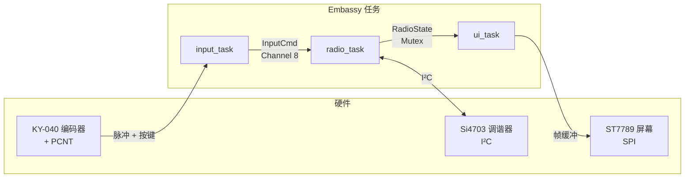
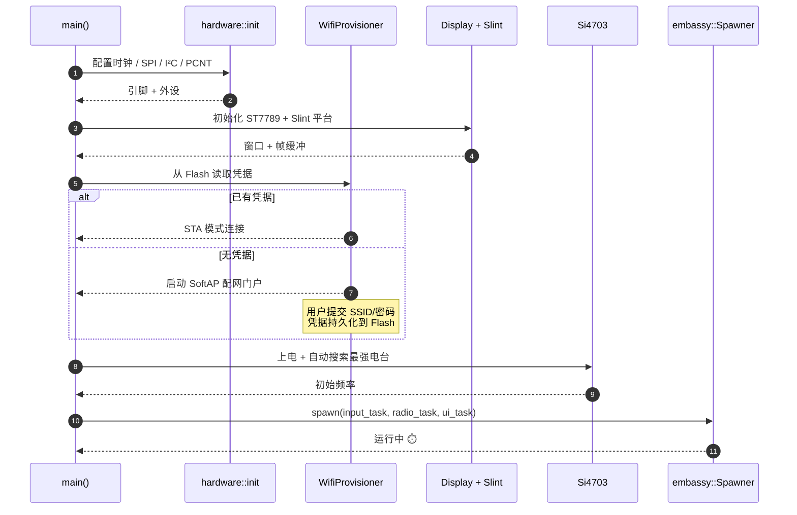

# ESP-Radio

> 一个面向 **ESP32-C6** 的完整 FM 收音机固件，纯 Rust 编写。
> 通过 SoftAP 强制门户配网，旋转编码器交互，配 240×320 ST7789 屏幕上的 Material 风格 Slint UI。

[English](./README.md) · [简体中文](./README.zh-CN.md)

<p>
  
  
  
  
  
  
  
  
</p>

---

## 📑 目录

- [ESP-Radio](#esp-radio)
  - [📑 目录](#-目录)
  - [✨ 功能特性](#-功能特性)
  - [🎬 演示](#-演示)
  - [🧱 硬件接线](#-硬件接线)
  - [🏗️ 架构](#️-架构)
  - [🚦 启动时序](#-启动时序)
  - [🧩 模块概览](#-模块概览)
  - [📁 项目结构](#-项目结构)
  - [🚀 快速开始](#-快速开始)
    - [1. 工具链](#1-工具链)
    - [2. 编译并烧录](#2-编译并烧录)
    - [3. WiFi 配网（仅首次）](#3-wifi-配网仅首次)
  - [🛠️ `cargo make` 任务一览](#️-cargo-make-任务一览)
  - [🖥️ 宿主机 UI 预览](#️-宿主机-ui-预览)
    - [macOS 26（Tahoe）注意](#macos-26tahoe注意)
  - [📡 RDS 能力矩阵](#-rds-能力矩阵)
  - [📦 性能与体积](#-性能与体积)
  - [🔄 开发工作流](#-开发工作流)
  - [🧰 技术栈](#-技术栈)
  - [🐛 常见问题与 FAQ](#-常见问题与-faq)
  - [🗺️ 路线图](#️-路线图)
    - [📑 设计文档](#-设计文档)
  - [🤝 参与贡献](#-参与贡献)
  - [🙏 致谢](#-致谢)
  - [📜 License](#-license)

---

## ✨ 功能特性

- 📻 **FM 调谐** —— Si4703 通过 I²C 驱动，开机自动扫描并跳到信号最强的电台；UI 支持 RDS（PS 电台名 + RT 滚动文字，兼容 GB2312/UTF-8 扩展）。
- 🔊 **音量与静音** —— 长按编码器可静音，UI 顶部带独立音量条。
- 🎛️ **触感操作** —— KY-040 旋转编码器接入 ESP32-C6 的 **PCNT** 硬件外设，无中断抖动；短按 = 自动搜台，长按（≥ 800 ms）= 静音切换。
- 📶 **WiFi 配网** —— 首次开机弹出 SoftAP 强制门户页面，凭据由 `esp-storage` 写入 Flash，下次开机自动联网。
- 🖥️ **Slint UI** —— 基于 Material-1.0 主题的 [`ui/radio_ui.slint`](./ui/radio_ui.slint)，软件渲染到 240×320 ST7789，可在 macOS / Linux / Windows 上离线预览。
- 🔁 **Embassy 异步** —— 全程 `no_std`，`embassy-executor` + `embassy-sync` 在输入任务、电台控制任务、UI 渲染循环之间传递事件。
- 🛠️ **`cargo make` 一站式工作流** —— 编译、烧录、Lint、固件体积分析、宿主机 UI 预览全部一条命令搞定。
- 🧪 **设备端测试** —— `embedded-test` + `probe-rs`，单元测试直接跑在真机上。

---

## 🎬 演示

| 启动画面 | 调谐+RDS | 静音 / 音量 |
|:---:|:---:|:---:|
| _补充 `docs/screenshots/boot.png`_ | _补充 `docs/screenshots/rds.png`_ | _补充 `docs/screenshots/mute.png`_ |

> 💡 不需要硬件也可以预览同一份 UI：
> `cargo make ui-preview-data` —— 详见 [宿主机 UI 预览](#%EF%B8%8F-宿主机-ui-预览)。

---

## 🧱 硬件接线

| 功能              | ESP32-C6 GPIO |
|-------------------|---------------|
| ST7789 SCK        | GPIO3         |
| ST7789 MOSI       | GPIO0         |
| ST7789 CS         | GPIO1         |
| ST7789 DC         | GPIO2         |
| ST7789 RST        | GPIO22        |
| ST7789 BLK 背光   | GPIO23        |
| Si4703 SDA (SDIO) | GPIO6         |
| Si4703 SCL (SCLK) | GPIO7         |
| Si4703 RST        | GPIO10        |
| 编码器 S1 (CLK)   | GPIO11        |
| 编码器 S2 (DT)    | GPIO18        |
| 编码器 KEY        | GPIO19        |

**用户交互**

- 旋转编码器 → 按 0.1 MHz 步进调台。
- 短按按键 → 自动跳到下一个强信号电台。
- 长按按键（≥ 800 ms）→ 切换静音。

---

## 🏗️ 架构

三个并发的 embassy 任务，通过无锁通道与一把共享互斥锁解耦：



- **`input_task`** 处理编码器脉冲与按键去抖，发送 `InputCmd::{TuneDelta, Seek, ToggleMute}` 事件。
- **`radio_task`** 拥有 Si4703 驱动，执行调台/搜台/静音、解析 RDS，将快照写入互斥保护的 `RadioState`。
- **`ui_task`** 大约 30 fps 唤醒，读取最新 `RadioState`，刷新绑定到 [`ui/radio_ui.slint`](./ui/radio_ui.slint) 的 Slint 模型。

---

## 🚦 启动时序



---

## 🧩 模块概览

可复用部分以 `no_std` 库形式提供，方便兄弟固件直接引用。

| 模块 | 文件 | 职责 |
|---|---|---|
| `display`         | [src/display/mod.rs](./src/display/mod.rs)               | ST7789 SPI 驱动、双帧缓冲、Slint 平台对接（`Platform` / `WindowAdapter` / `LineBufferProvider`）。 |
| `rotary_encoder`  | [src/rotary_encoder/mod.rs](./src/rotary_encoder/mod.rs) | 基于 **PCNT** 外设的 KY-040 驱动，自带溢出处理，输出干净的 `±N` 增量与按键事件，无中断抖动。 |
| `si4703`          | [src/si4703/mod.rs](./src/si4703/mod.rs)                 | Si4703 I²C 寄存器映射、调台/搜台/音量/静音、RDS A/B 组解码（PS、RT、PI），预留 GB2312/UTF-8 扩展钩子。 |
| `wifi_provision`  | [src/wifi_provision/mod.rs](./src/wifi_provision/mod.rs) | 基于 `picoserve` 的 SoftAP + DHCP + DNS 重定向门户，配套 [`storage.rs`](./src/wifi_provision/storage.rs) 实现 Flash 持久化。 |

---

## 📁 项目结构

```text
esp-radio/
├── src/
│   ├── lib.rs                    # 可复用的驱动 crate（no_std）
│   ├── display/                  # ST7789 SPI 驱动 + Slint 平台对接
│   ├── rotary_encoder/           # KY-040 编码器驱动（基于 PCNT 外设）
│   ├── si4703/                   # Si4703 FM 芯片 I²C 驱动 + RDS 解析
│   ├── wifi_provision/           # SoftAP 配网门户 + Flash 持久化
│   └── bin/radio/                # 主固件（拆分为 5 个模块）
│       ├── main.rs               # 启动流程与装配
│       ├── hardware.rs           # GPIO/SPI/I²C/PCNT 初始化
│       ├── state.rs              # 共享 embassy-sync 原语
│       ├── tasks.rs              # 异步任务（输入 / 电台 / UI）
│       └── ui.rs                 # Slint 与电台状态的桥接
├── ui/
│   ├── radio_ui.slint            # 主 Material UI
│   ├── preview_data.json         # 宿主机预览样例数据
│   ├── main.slint
│   └── slint_st7789_ui.slint
├── examples/                     # 单功能示例
│   ├── si4703_fm_radio.rs
│   ├── rotary_encoder.rs
│   ├── slint_st7789.rs
│   └── wifi_provision.rs
├── material-1.0/                 # 内置的 Slint Material 组件库
├── Cargo.toml
├── Makefile.toml                 # cargo-make 任务集
├── rust-toolchain.toml           # nightly + riscv32imac 目标
└── build.rs
```

---

## 🚀 快速开始

### 1. 工具链

[`rust-toolchain.toml`](./rust-toolchain.toml) 已经锁定通道与 target，`rustup` 会自动下载：

```bash
# 必备 cargo 工具
cargo install cargo-make
cargo install probe-rs --features cli   # cargo run / probe-rs attach 都依赖它

# 可选：宿主机 UI 预览（cargo-make 也会自动安装）
cargo install slint-viewer
```

### 2. 编译并烧录

```bash
# 通过 USB 接好 ESP32-C6 后：
cargo make flash-release          # 编译并烧录主固件
cargo make monitor                # 实时查看 RTT 日志

# 或者只跑某个示例：
cargo make flash-example -e EXAMPLE=si4703_fm_radio
```

### 3. WiFi 配网（仅首次）

1. 烧录完成后，设备会启动名为 `ESP-Radio-Setup` 的 **SoftAP**。
2. 用手机/电脑连接，强制门户页会自动弹出。
3. 选择家里的 SSID 并输入密码，凭据写入 Flash 后设备重启进入 STA 模式。

---

## 🛠️ `cargo make` 任务一览

| 任务                        | 用途                                                          |
|-----------------------------|----------------------------------------------------------------|
| `build` / `build-release`   | 编译主固件                                                    |
| `build-all` / `…-release`   | 编译库 + 所有示例                                             |
| `build-example`             | 编译单个示例（`EXAMPLE=<名字>`）                              |
| `flash` / `flash-release`   | 编译 **并** 通过 `probe-rs run` 烧录                          |
| `flash-example`             | 烧录指定示例（`EXAMPLE=<名字>`）                              |
| `monitor`                   | 附加 `probe-rs` 输出 defmt 日志                               |
| `check` / `clippy` / `fmt`  | 标准代码质量检查                                              |
| `fmt-check`                 | 仅检查格式不修改文件                                          |
| `size` / `size-example`     | 用 `rust-size` 输出 release 固件大小                          |
| `test`                      | 设备端测试（`embedded-test` + `probe-rs`）                    |
| `clean`                     | `cargo clean`                                                 |
| `ci`                        | `fmt-check` + `clippy` + `build-all-release`                  |
| `dev`                       | 快速开发循环：`check` + `clippy`                              |
| `release`                   | 完整发布流水线                                                |
| `ui-install-viewer`         | 安装 / 校验宿主机的 `slint-viewer`                            |
| `ui-preview`                | 在宿主机实时预览 UI（保存自动刷新）                           |
| `ui-preview-data`           | 同上，但预先加载 RDS / 音量样例数据                            |

---

## 🖥️ 宿主机 UI 预览

无需连接 ESP32 即可迭代 Slint UI：

```bash
cargo make ui-preview-data
```

会弹出原生窗口并加载 [`ui/preview_data.json`](./ui/preview_data.json) 的模拟数据，编辑 [`ui/radio_ui.slint`](./ui/radio_ui.slint) 保存即热更新。

### macOS 26（Tahoe）注意

部分传递依赖（如 `bonjour-sys`）会直接调用 `bindgen`，在 macOS 26 SDK 下会报 `architecture not supported`。本仓库的 `ui-*` 任务已经自动注入 `SDKROOT` 和 `BINDGEN_EXTRA_CLANG_ARGS`，**直接 `cargo make ui-preview` 即可**，无需手动 export 任何环境变量。

---

## 📡 RDS 能力矩阵

| 能力                            | 状态  | 说明 |
|---------------------------------|:-----:|------|
| 节目识别码 (PI)                 | ✅    | 用作电台指纹缓存。 |
| 节目名 (PS, 8 字符)             | ✅    | 显示为加粗的电台名。 |
| 节目文本 (RT, ≤ 64 字符)        | ✅    | UI 滚动展示。 |
| GB2312（中文扩展）              | ✅    | 检测到帧头后自动回退到 UTF-8。 |
| UTF-8（RDS 扩展）               | ✅    | 通过引导序列自动识别。 |
| 交通通告 (TA)                   | 🟡    | 已解码，UI 暂未呈现。 |
| 时间码 (CT)                     | ✅    | 解码自 group 4A，顶栏以 `HH:MM` 呈现（已叠加本地时区偏移）。 |
| 备用频率 (RDS-AF)               | ⏳    | 计划中。 |

✅ 已上线 · 🟡 部分支持 · ⏳ 规划中

---

## 📦 性能与体积

来自 `cargo make build-release` 在 Rust nightly 下（LTO `fat`、`opt-level=z`）的典型数据：

| 指标                            | 典型值                       |
|--------------------------------|------------------------------|
| Flash 镜像（`.text`）          | ~ 740 KB                     |
| 静态 RAM（`.bss` + `.data`）   | ~ 90 KB                      |
| 堆（`esp-alloc`）              | 96 KB 预留                   |
| Slint 帧缓冲                   | 1 行 × 240 × 16 bpp          |
| UI 渲染帧率                    | ~ 30 fps                     |
| 调台 → 出声延迟                | < 120 ms                     |
| 上电到首帧                     | ~ 850 ms（凭据已缓存时）     |

> 在 release 构建后运行 `cargo make size` 可在 **你的** 工具链下打印精确的段大小。

---

## 🔄 开发工作流

```mermaid
flowchart LR
    A([编辑代码]) --> B{cargo make}
    B -->|dev| C[check + clippy]
    B -->|ci|  D[fmt-check + clippy + build-all-release]
    B -->|release| E[fmt-check + clippy + build-all-release + size]
    C --> F[flash-release]
    D --> F
    E --> F
    F --> G[monitor — RTT defmt 日志]
    G --> A
```

**推荐迭代节奏**

1. 改 UI → `cargo make ui-preview-data`（即时热更新）。
2. 改驱动/逻辑 → `cargo make dev`（快速类型/Lint 检查）。
3. 上板调试 → `cargo make flash-release && cargo make monitor`。
4. 提 PR 前 → `cargo make ci`。

---

## 🧰 技术栈

- **MCU** —— ESP32-C6（RISC-V，单核，WiFi 6 + BLE 5）
- **异步运行时** —— [`embassy`](https://embassy.dev)（`embassy-executor` / `embassy-net` / `embassy-time` / `embassy-sync`）
- **HAL** —— [`esp-hal`](https://github.com/esp-rs/esp-hal) `1.1` + [`esp-rtos`](https://crates.io/crates/esp-rtos) `0.3`
- **WiFi/BLE** —— [`esp-radio`](https://crates.io/crates/esp-radio) `0.18`（coex + WiFi + BLE）
- **GUI** —— [`slint`](https://slint.dev) `1.16` 软件渲染，启用 `compat-1-2` + `unsafe-single-threaded`
- **显示驱动** —— [`mipidsi`](https://crates.io/crates/mipidsi) `0.10`（ST7789），通过 `embedded-hal-bus` 共享 SPI
- **存储** —— [`esp-storage`](https://crates.io/crates/esp-storage) 持久化 WiFi 凭据
- **日志** —— `defmt` + `rtt-target` + `panic-rtt-target`
- **构建** —— Rust nightly，`riscv32imac-unknown-none-elf`，`build-std=alloc,core`，LTO `fat`，`opt-level=z`

---

## 🐛 常见问题与 FAQ

<details>
<summary><b>probe-rs 找不到芯片</b></summary>

检查 USB-JTAG 桥接是否连接、是否进入下载模式，重新 <code>cargo make monitor</code>。macOS 上还要确认 <code>系统设置 → 隐私 → USB</code> 已授权。
</details>

<details>
<summary><b>WiFi 一直连不上</b></summary>

启动时长按编码器可清除已存凭据，下次开机会重新进入 SoftAP 配网门户。也可以用 <code>probe-rs erase --chip esp32c6</code> 直接擦除 Flash。
</details>

<details>
<summary><b>macOS 26（Tahoe）上 <code>bonjour-sys</code> 编译失败</b></summary>

请走 <code>cargo make ui-preview*</code>（已注入 <code>SDKROOT</code> 和 <code>BINDGEN_EXTRA_CLANG_ARGS</code>）。不要在 Tahoe 下裸跑 <code>cargo install slint-viewer</code>。
</details>

<details>
<summary><b>屏幕一直黑屏</b></summary>

确认 GPIO23 背光接好，并按 <code>SCK / MOSI / CS / DC / RST</code> 顺序核对 SPI 接线。最常见的坑是 <code>RST</code> 引脚悬空。
</details>

<details>
<summary><b>为什么必须用 nightly Rust？</b></summary>

我们依赖 <code>build-std</code> 在 <code>riscv32imac-unknown-none-elf</code> 下重建 <code>core</code>/<code>alloc</code>，并启用了若干仅 nightly 才支持的 <code>esp-hal</code> 特性。具体通道见 <a href="./rust-toolchain.toml"><code>rust-toolchain.toml</code></a>。
</details>

<details>
<summary><b>能跑在 ESP32 / ESP32-S3 / ESP32-C3 上吗？</b></summary>

大部分代码可移植，但当前 <code>Cargo.toml</code> 里 <code>esp-hal</code>、<code>esp-rtos</code>、<code>esp-radio</code>、<code>esp-storage</code> 的 feature 是写死 ESP32-C6 的。移植需要切换 feature 标志并重新核对 GPIO 表。
</details>

---

## 🗺️ 路线图

- [x] FM 调谐 + 自动搜台 + RDS PS / RT
- [x] WiFi 强制门户配网 + Flash 持久化
- [x] ST7789 上的 Slint Material UI
- [x] 设备端测试（`embedded-test`）
- [x] RDS 时间码（CT）—— 从 group 4A 自动同步墙钟
- [ ] RDS-AF 备用频率跟踪
- [ ] 网络电台兜底（WiFi 上的 HLS / Icecast）
- [ ] 通过 WiFi 进行 OTA 升级 — *设计完成，实施暂缓* → 详见 [docs/ota-design.zh-CN.md](./docs/ota-design.zh-CN.md)
- [ ] UI 增加电池电量挂件
- [ ] BLE 遥控（HID 音量键）

### 📑 设计文档

- [OTA 固件升级 — 技术设计](./docs/ota-design.zh-CN.md)

---

## 🤝 参与贡献

欢迎贡献！提交 PR 之前请：

1. 本地跑一遍 `cargo make ci`，必须通过。
2. 一个 PR 只做一件事（一个功能或一个修复）。
3. PR 描述里写清楚动机，关联相关 issue。
4. [`src/lib.rs`](./src/lib.rs) 中新增公开 API 必须配 rustdoc 注释。
5. UI 改动请附上 `cargo make ui-preview-data` 的截图。

如果是较大改动，建议先开 issue 讨论方案。

---

## 🙏 致谢

没有这些社区，这个项目无从谈起：

- [esp-rs](https://github.com/esp-rs) —— `esp-hal`、`esp-rtos`、`esp-radio`、`esp-storage`、`esp-bootloader-esp-idf`。
- [embassy-rs](https://embassy.dev) —— 嵌入式异步运行时。
- [Slint](https://slint.dev) —— 嵌入式声明式 GUI。
- [mipidsi](https://github.com/almindor/mipidsi) —— 纯 Rust 的显示驱动。
- [probe-rs](https://probe.rs) —— 烧录、调试、RTT 日志。
- [Material Design](https://m3.material.io) 与本仓库内置的 [`material-1.0`](./material-1.0/) Slint 组件库。

---

## 📜 License

本仓库当前用于学习与原型用途。[`material-1.0/`](./material-1.0/) 内的 UI 资源沿用其上游 License（详见 `material-1.0/LICENSE.md`）。

项目源码：参见各文件头说明；若仓库尚未补充 LICENSE 文件，则在补充前作者保留所有权利。
