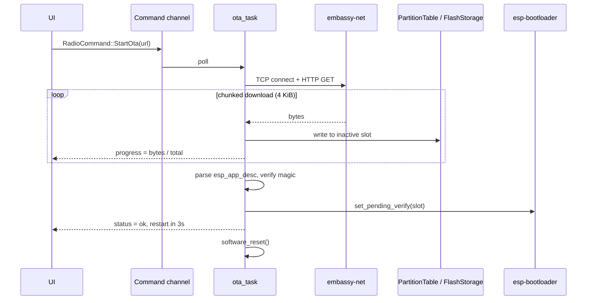

# OTA Firmware Update — Technical Design

> Status: **Draft (deferred implementation)**
> Author: esp-radio maintainers
> Last updated: 2026-06-25
> Tracking: Roadmap item *"OTA firmware update via HTTP/HTTPS"*

This document captures the design, the open questions and the actionable
work-breakdown for adding **Over-The-Air firmware updates** to the
`esp-radio` project. It is intentionally written *before* coding begins so
that the implementation can be picked up incrementally without re-doing the
investigation.

---

## 1. Goals & Non-Goals

### 1.1 Goals
- Allow the device to fetch a new application image from a configurable
  HTTP(S) URL and boot into it on the next reset.
- Provide UI feedback (progress %, success/failure) during the update.
- Support **safe rollback**: if the new image fails to mark itself valid
  within N boots, the bootloader reverts to the previous slot automatically.
- Be triggerable from the existing input devices (rotary-encoder long
  press) **and** from a future companion app via Wi-Fi.

### 1.2 Non-Goals (deferred)
- Delta updates (`esp_delta_ota`-style).
- Code signing / secure boot. (Will be tracked separately once the
  bootloader supports it on `esp-hal` targets.)
- Background download while audio is playing — first cut blocks the radio
  task during download.

---

## 2. Background — Current State of the Project

| Concern                          | Current state                                                          |
| -------------------------------- | ---------------------------------------------------------------------- |
| Bootloader                       | `esp-bootloader-esp-idf 0.5.0` (already in `Cargo.toml`)               |
| Partition layout                 | **espflash default `single-app`** (no `ota_0` / `ota_1` / `otadata`)   |
| Flash access                     | `esp-storage 0.9.0`, single `FlashStorage` owned by `WifiProvisioner`  |
| Network stack                    | `embassy-net` + esp-radio Wi-Fi (provisioned via `wifi_provision`)     |
| HTTP client                      | **None.** `picoserve` is server-only.                                  |
| TLS                              | None.                                                                  |
| App descriptor (`esp_app_desc`)  | Emitted by `esp-bootloader-esp-idf::esp_app_desc!` (already used).     |

The two structural blockers are:

1. **No partition table** capable of holding two app slots.
2. **Flash handle ownership** — `FlashStorage::new(peripherals.FLASH)` is
   moved into `WifiProvisioner::new()` and never released. OTA needs a
   second consumer of the same `FLASH` peripheral.

---

## 3. Partition Table

### 3.1 Layout (proposed `partitions.csv`)

```csv
# Name,   Type, SubType, Offset,   Size,     Flags
nvs,      data, nvs,     0x9000,   0x6000,
phy_init, data, phy,     0xf000,   0x1000,
otadata,  data, ota,     0x10000,  0x2000,
ota_0,    app,  ota_0,   0x20000,  0x1E0000,
ota_1,    app,  ota_1,   0x200000, 0x1E0000,
storage,  data, nvs,     0x3E0000, 0x20000,
```

- 4 MiB flash assumed (ESP32-C6 typical). Adjust `storage` offset/size on
  larger boards.
- `nvs` block reserved for credentials; **migration plan** (§ 7.2)
  guarantees existing devices keep their Wi-Fi config.
- Two ~1.875 MiB app slots leave headroom for the current firmware
  (≈ 1.1 MiB release build) plus growth.

### 3.2 Tooling

- Generate via `espflash partition-table` or rely on
  `esp-bootloader-esp-idf::PartitionTable` runtime parser.
- Wire into `cargo make build-release` & `cargo make run-release` via
  `--partition-table partitions.csv` flag (espflash 4.x supports it).

---

## 4. Architecture

### 4.1 Module layout

```
src/
├── ota/
│   ├── mod.rs        // public API: trigger, progress channel, errors
│   ├── http.rs       // streaming HTTP(S) downloader (reqwless wrapper)
│   ├── writer.rs     // chunked writer over PartitionTable + esp-storage
│   └── verify.rs     // app_desc parsing + magic/CRC sanity checks
├── bin/radio/
│   ├── tasks.rs      // new ota_task() consuming RadioCommand::StartOta
│   └── ui.rs         // progress overlay
```

### 4.2 Data flow



### 4.3 Flash-handle sharing

The cleanest fix is to expose `FlashStorage` as a **single static owned by
`main`**, then hand out short-lived references guarded by an
`embassy_sync::mutex::Mutex<NoopRawMutex, FlashStorage>`. Both
`wifi_provision` and `ota` borrow it cooperatively.

Refactor surface:

- `WifiProvisioner::new(flash, …)` → `WifiProvisioner::new(flash_mutex, …)`.
- `wifi_provision::storage::CredentialStorage` takes
  `&Mutex<NoopRawMutex, FlashStorage>` instead of owning it.
- `ota::Updater::new(flash_mutex, partitions)` reuses the same handle.

Estimated diff: ~120 LoC across `wifi_provision/{mod,storage}.rs` and
`bin/radio/main.rs`.

---

## 5. Public API Sketch

```rust
// src/ota/mod.rs
pub struct OtaUpdater<'a> {
    flash: &'a Mutex<NoopRawMutex, FlashStorage>,
    pt:    PartitionTable<'static>,
}

#[derive(defmt::Format)]
pub enum OtaError {
    Connect, Http(u16), Truncated, BadMagic,
    AppDescMismatch { found: heapless::String<32> },
    Flash, NoFreeSlot,
}

#[derive(defmt::Format, Clone, Copy)]
pub enum OtaProgress {
    Connecting,
    Downloading { written: u32, total: u32 },
    Verifying,
    Switching,
    Done,
    Failed(OtaError),
}

impl<'a> OtaUpdater<'a> {
    pub async fn run(
        &mut self,
        stack: &Stack<'_>,
        url: &str,
        progress: &Channel<NoopRawMutex, OtaProgress, 4>,
    ) -> Result<(), OtaError> { /* … */ }
}
```

`RadioCommand::StartOta(heapless::String<256>)` is added to the existing
command channel; the response funnels into `RadioState.ota_progress`.

---

## 6. Dependencies to Add

| Crate                  | Version       | Notes                                                        |
| ---------------------- | ------------- | ------------------------------------------------------------ |
| `reqwless`             | `0.13`        | `no_std`, async, supports streaming bodies.                  |
| `embedded-tls`         | `0.18`        | Required only if HTTPS is enabled (feature `tls`).           |
| `embedded-io-async`    | already in    | Re-exported by reqwless; no new entry.                       |
| `crc`                  | `3.x`         | Optional integrity check before commit.                      |
| `heapless`             | already in    | For URL & error strings.                                     |

> Open question: `reqwless` + `embassy-net` + esp-radio 0.18 stack has had
> some flakiness around DNS retries. We will land an integration test in
> `examples/` first.

---

## 7. Risks & Mitigations

### 7.1 Bricked device on bad image
- **Risk:** new image hangs early → no `mark_app_valid_cancel_rollback`.
- **Mitigation:** rely on `esp-bootloader-esp-idf` rollback; require the
  application to call `Ota::mark_current_valid()` only after the UI thread
  has rendered a frame and Wi-Fi is up.

### 7.2 Existing device migration (NVS offset)
- The current default partition table places NVS at a different offset
  than the proposed one, so previously-stored Wi-Fi credentials will be
  unreadable after the first OTA-capable flash.
- **Mitigation:** add a `cargo make migrate-flash` task that erases NVS
  before flashing the OTA-capable firmware, and document a one-time
  re-provisioning step in the changelog.

### 7.3 HTTPS certificate management
- Embedding a CA bundle is heavyweight; pinning a single certificate is
  fragile.
- **Mitigation (phase 1):** ship HTTP-only with a documented warning;
  HTTPS gated behind `--features ota-tls` and a single pinned root cert.

### 7.4 Flash wear during repeated retries
- Each failed attempt erases the inactive slot.
- **Mitigation:** require `Content-Length`; refuse to begin if length > slot.
  Cap automatic retries at 3 per session.

### 7.5 Concurrent flash access
- `wifi_provision` may write credentials while OTA is running.
- **Mitigation:** the `Mutex<FlashStorage>` from § 4.3 serialises access;
  OTA holds the mutex only while writing a chunk (~4 KiB) to keep
  credential writes responsive.

---

## 8. Work Breakdown (estimated, ordered)

| #  | Task                                                                          | Est. (h) |
| -- | ----------------------------------------------------------------------------- | -------- |
| 1  | Add `partitions.csv` + wire espflash flags in `Makefile.toml`                  | 2        |
| 2  | Refactor `FlashStorage` ownership into shared `Mutex` (incl. provisioner)     | 4        |
| 3  | New `src/ota/writer.rs` — partition-aware chunked writer + unit tests          | 4        |
| 4  | New `src/ota/http.rs` — reqwless wrapper, header parsing, retry policy        | 6        |
| 5  | New `src/ota/verify.rs` — `esp_app_desc` parsing, magic/CRC checks            | 3        |
| 6  | Hook `RadioCommand::StartOta` into `tasks.rs`, progress channel               | 3        |
| 7  | UI overlay (Slint) for progress %, success/failure                            | 4        |
| 8  | `mark_app_valid_cancel_rollback` on healthy boot                              | 2        |
| 9  | HTTPS feature flag + pinned-cert support (`embedded-tls`)                     | 6        |
| 10 | E2E hardware test: flash A → OTA to B → reboot → OTA back to A                | 4        |
| 11 | Docs: README updates, migration note, troubleshooting                         | 2        |
|    | **Total**                                                                     | **40**   |

> ≈ 5 working days for a single engineer with the hardware on hand.

---

## 9. Open Questions

1. Should the firmware advertise its current version on the local network
   (mDNS TXT record) so a companion app can detect upgrades automatically?
2. Do we want progressive rollout via a *manifest* (`latest.json` listing
   per-board URLs and SHA-256), or is a single hard-coded URL good enough
   for v1?
3. Where does the build pipeline publish artifacts? (GitHub Releases is
   the obvious candidate; needs CI changes outside this repo.)

---

## 10. Decision Log

- **2026-06-25** — Implementation deferred. This document is the canonical
  reference; revisit before starting any OTA-related coding work.
