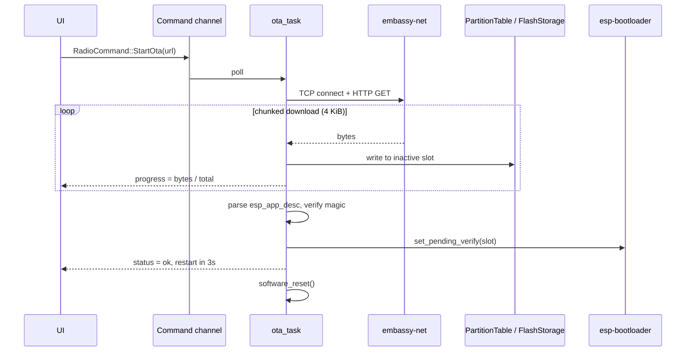

# OTA Firmware Update — Technical Design

> Status: **Phase 1 + 2a in progress** — partition table, flash hand-off, sector-buffered writer landed
> Author: esp-radio maintainers
> Last updated: 2026-06-27
> Tracking: Roadmap item *"OTA firmware update via HTTP/HTTPS"*

This document captures the design, the open questions and the actionable
work-breakdown for adding **Over-The-Air firmware updates** to the
`esp-radio` project. It is intentionally written *before* coding begins so
that the implementation can be picked up incrementally without re-doing the
investigation.

---

## 1. Goals & Non-Goals

### 1.1 Goals
- Allow the device to fetch a new application image from a configurable
  HTTP(S) URL and boot into it on the next reset.
- Provide UI feedback (progress %, success/failure) during the update.
- Be **rollback-ready**: record the OTA image state in `otadata` so a
  future bootloader build with `BOOTLOADER_APP_ROLLBACK_ENABLE` can act
  on it without an additional firmware revision. (The stock bootloader
  shipped by `espflash` ignores the field today, so this is preparatory
  bookkeeping only — there is no automatic revert at this layer.)
- Be triggerable from the existing input devices (rotary-encoder long
  press) **and** from a future companion app via Wi-Fi.

### 1.2 Non-Goals (deferred)
- Delta updates (`esp_delta_ota`-style).
- Code signing / secure boot. (Will be tracked separately once the
  bootloader supports it on `esp-hal` targets.)
- Background download while audio is playing — first cut blocks the radio
  task during download.

---

## 2. Background — Current State of the Project

| Concern                          | Current state                                                          |
| -------------------------------- | ---------------------------------------------------------------------- |
| Bootloader                       | `esp-bootloader-esp-idf 0.5.0` (already in `Cargo.toml`)               |
| Partition layout                 | **`partitions.csv` shipped 2026-06-27** (ota_0 / ota_1 / otadata)      |
| Flash access                     | `esp-storage 0.9.0`; handle threaded WiFi → presets, OTA borrows it    |
| Network stack                    | `embassy-net` + esp-radio Wi-Fi (provisioned via `wifi_provision`)     |
| HTTP client                      | **None.** `picoserve` is server-only.                                  |
| TLS                              | None.                                                                  |
| App descriptor (`esp_app_desc`)  | Emitted by `esp-bootloader-esp-idf::esp_app_desc!` (already used).     |
| OTA primitives                   | `esp-bootloader-esp-idf::ota::Ota` + `OtaUpdater` (no need to re-roll) |

The two structural blockers were:

1. ~~No partition table capable of holding two app slots.~~ ✅ Resolved: see `partitions.csv` at the repo root.
2. ~~Flash handle ownership.~~ ✅ Resolved: see § 4.3. The flash
   handle is already passed `WifiProvisioner` → `PresetStore` (via
   `into_flash()`); OTA further borrows it from `PresetStore` via the
   new `pause()` / `resume()` API.

---

## 3. Partition Table

### 3.1 Layout (proposed `partitions.csv`)

```csv
# Name,   Type, SubType, Offset,   Size,     Flags
nvs,      data, nvs,     0x9000,   0x6000,
phy_init, data, phy,     0xf000,   0x1000,
otadata,  data, ota,     0x10000,  0x2000,
ota_0,    app,  ota_0,   0x20000,  0x1E0000,
ota_1,    app,  ota_1,   0x200000, 0x1E0000,
storage,  data, nvs,     0x3E0000, 0x20000,
```

- 4 MiB flash assumed (ESP32-C6 typical). Adjust `storage` offset/size on
  larger boards.
- `nvs` block reserved for credentials; **migration plan** (§ 7.2)
  guarantees existing devices keep their Wi-Fi config.
- Two ~1.875 MiB app slots leave headroom for the current firmware
  (≈ 1.1 MiB release build) plus growth.

### 3.2 Tooling

- Generate via `espflash partition-table` or rely on
  `esp-bootloader-esp-idf::PartitionTable` runtime parser.
- Wire into `cargo make build-release` & `cargo make run-release` via
  `--partition-table partitions.csv` flag (espflash 4.x supports it).

---

## 4. Architecture

### 4.1 Module layout

```
src/
├── ota/
│   ├── mod.rs        // public API: trigger, progress channel, errors
│   ├── http.rs       // streaming HTTP(S) downloader (reqwless wrapper)
│   ├── writer.rs     // chunked writer over PartitionTable + esp-storage
│   └── verify.rs     // app_desc parsing + magic/CRC sanity checks
├── bin/radio/
│   ├── tasks.rs      // new ota_task() consuming RadioCommand::StartOta
│   └── ui.rs         // progress overlay
```

### 4.2 Data flow



### 4.3 Flash-handle sharing — "pause / resume" hand-off

**Decision (2026-06-27, revised):** the original draft proposed a
global `Mutex<NoopRawMutex, FlashStorage>` shared by every writer. We
rejected that in favour of an explicit single-owner hand-off because
the project already threads the flash handle through unique owners:

```
FlashStorage::new(FLASH)
  └─► WifiProvisioner::new(flash)
        └─► provisioner.into_flash()  ──►  PresetStore::open(flash)
              └─► (long-lived owner inside radio_control_task)
```

OTA happens at most a handful of times per device-month, while the
preset store writes once per tune session. Forcing every preset write
to acquire a mutex just to support a rare OTA is the wrong trade-off.

Instead the preset store gains a small "pause" API:

```rust
impl PresetStore<'d> {
    pub fn pause(self) -> (FlashStorage<'d>, PausedPresetStore);
}
impl PausedPresetStore {
    pub fn resume<'d>(self, flash: FlashStorage<'d>) -> PresetStore<'d>;
}
```

…paired with a `RadioState.ota_in_progress` interlock so the radio
control task suspends `last_tuned` debounce flushes while the handle
is loaned out (see `flush_last_tuned_if_due` in `tasks.rs`).

Refactor surface (actual diff that landed):

- `presets.rs` (+~80 LoC): `pause`, `resume`, `PausedPresetStore`,
  documentation.
- `state.rs` (+~30 LoC): `ota_in_progress` field +
  `publish_ota_in_progress` helper.
- `tasks.rs` (+10 LoC): `flush_last_tuned_if_due` short-circuits when
  `RADIO_STATE.ota_in_progress` is set.

This is roughly a quarter of the size of the original `Mutex`-based
proposal and keeps the steady-state lock-free.

---

## 5. Public API Sketch

### 5.1 Writer (landed 2026-06-27, #11-2a)

```rust
// src/bin/radio/ota/writer.rs
pub struct OtaWriter<'d> { /* opaque */ }

#[derive(defmt::Format, Clone, Copy, PartialEq, Eq)]
pub enum OtaError {
    ImageTooLarge { image_size: u32, slot_size: u32 },
    SizeMismatch  { expected: u32, received: u32 },
    SlotNotFound,
    Flash(esp_storage::FlashStorageError),
    Partition(esp_bootloader_esp_idf::partitions::Error),
}

impl<'d> OtaWriter<'d> {
    pub fn begin(
        flash: FlashStorage<'d>,
        expected_size: Option<u32>,
    ) -> Result<Self, OtaError>;
    pub async fn write_chunk(&mut self, chunk: &[u8]) -> Result<(), OtaError>;
    pub fn bytes_written(&self) -> u32;
    pub fn progress_percent(&self) -> Option<u8>;
    pub fn finalize(self) -> Result<FlashStorage<'d>, OtaError>;
    pub fn abort(self) -> FlashStorage<'d>;
}
```

**Buffering strategy.** `esp-storage::FlashStorage` exposes two trait
impls: `embedded_storage::Storage::write` does read-modify-erase-write
on *every* call (one full 4 KiB cycle even for a 16-byte payload),
while `embedded_storage::nor_flash::NorFlash::{erase,write}` are raw
but respect alignment. Caller chunks (HTTP packets) arrive at
unpredictable boundaries, so `OtaWriter` accumulates them in a 4 KiB
heap-allocated sector buffer and flushes only when full (or on
`finalize`). This keeps flash wear and programming time at the
theoretical minimum: exactly one erase + one program per sector,
~30–50 ms each. A 1.5 MiB image flushes ~384 sectors → 12–20 s
wall-clock, with a `Timer::after_micros(0)` yield between sectors so
the embassy executor can keep WiFi / WDT alive.

**Memory budget.** Both 3 KiB partition-table buffers and the 4 KiB
sector accumulator live on the heap — the crate-wide
`deny(clippy::large_stack_frames)` would otherwise reject any 1 KiB+
stack frame. Peak heap usage during OTA: ~7 KiB (sector buffer +
short-lived PT buffers in `begin`/`finalize`).

### 5.2 Downloader / progress (#11-3, pending)

```rust
// src/bin/radio/ota/http.rs (planned)
#[derive(defmt::Format, Clone, Copy)]
pub enum OtaProgress {
    Connecting,
    Downloading { written: u32, total: u32 },
    Verifying,
    Switching,
    Done,
    Failed(OtaError),
}

pub async fn run_http_ota(
    stack: &Stack<'_>,
    url: &str,
    flash: FlashStorage<'_>,
    progress: &Channel<NoopRawMutex, OtaProgress, 4>,
) -> Result<FlashStorage<'_>, OtaError>;
```

`RadioCommand::StartOta(heapless::String<256>)` is added to the existing
command channel; the response funnels into `RadioState.ota_progress`.

---

## 6. Dependencies to Add

| Crate                  | Version       | Notes                                                        |
| ---------------------- | ------------- | ------------------------------------------------------------ |
| `reqwless`             | `0.13`        | `no_std`, async, supports streaming bodies.                  |
| `embedded-tls`         | `0.18`        | Required only if HTTPS is enabled (feature `tls`).           |
| `embedded-io-async`    | already in    | Re-exported by reqwless; no new entry.                       |
| `crc`                  | `3.x`         | Optional integrity check before commit.                      |
| `heapless`             | already in    | For URL & error strings.                                     |

> Open question: `reqwless` + `embassy-net` + esp-radio 0.18 stack has had
> some flakiness around DNS retries. We will land an integration test in
> `examples/` first.

---

## 7. Risks & Mitigations

### 7.1 Bricked device on bad image
- **Risk:** new image hangs early; user is left with a non-booting unit.
- **Current state:** the stock bootloader shipped by `espflash` does
  **not** honour `OtaImageState`, so there is no automatic rollback. A
  bad image must be recovered by re-flashing over USB.
- **Future mitigation:** ship a bootloader built with
  `BOOTLOADER_APP_ROLLBACK_ENABLE`. Once that's in place, the existing
  call to `Ota::mark_current_valid()` (already gated on UI + Wi-Fi
  having come up) will arm proper rollback without further app-side
  changes.

### 7.2 Existing device migration (Wi-Fi credentials)

- The radio's WiFi credentials are stored in the **last sector of the
  flash chip** (`0x3F_F000`), set by
  `wifi_provision::storage::DEFAULT_STORAGE_OFFSET`.
- The new `partitions.csv` places `storage` at `0x3E_0000`–`0x400000`,
  which **includes** that exact sector; existing devices therefore
  retain their saved Wi-Fi config across the partition-table change
  with **no migration step required**.
- The radio's preset record (`0x3E_0000`, see
  `presets::DEFAULT_PRESET_OFFSET`) likewise lives inside the new
  `storage` partition and is preserved.
- **Caveat:** the *first* flash with the new partition table still
  needs to write the bootloader + partition table itself, so it is a
  one-shot full re-flash. Subsequent firmware bumps are the regular
  OTA path with no end-user friction.

### 7.3 HTTPS certificate management
- Embedding a CA bundle is heavyweight; pinning a single certificate is
  fragile.
- **Mitigation (phase 1):** ship HTTP-only with a documented warning;
  HTTPS gated behind `--features ota-tls` and a single pinned root cert.

### 7.4 Flash wear during repeated retries
- Each failed attempt erases the inactive slot.
- **Mitigation:** require `Content-Length`; refuse to begin if length > slot.
  Cap automatic retries at 3 per session.

### 7.5 Concurrent flash access
- `wifi_provision` and the preset store both write to the `storage`
  partition; the OTA writer needs the *whole* flash handle to populate
  an inactive app slot.
- **Mitigation:** see § 4.3. The `pause` / `resume` hand-off plus the
  `ota_in_progress` interlock keeps every writer serialised without
  introducing a runtime mutex on the hot path.

---

## 8. Work Breakdown (estimated, ordered)

| #  | Task                                                                          | Est. (h) | Status   |
| -- | ----------------------------------------------------------------------------- | -------- | -------- |
| 1  | Add `partitions.csv` + flash hand-off (`pause`/`resume`) + state interlock    | 4        | ✅ done  |
| 2  | Skipped — `esp-bootloader-esp-idf` already provides `Ota` / `OtaUpdater`      | 0        | n/a      |
| 3  | New `src/bin/radio/ota/writer.rs` — sector-buffered NOR writer + activate | 2        | ✅ done  |
| 4  | New `src/ota/http.rs` — reqwless wrapper, header parsing, retry policy        | 6        | pending  |
| 5  | New `src/ota/verify.rs` — SHA-256 check + `esp_app_desc` sanity               | 3        | pending  |
| 6  | Hook `RadioCommand::StartOta` into `tasks.rs`, progress channel               | 3        | pending  |
| 7  | UI overlay (Slint) for progress %, success/failure                            | 4        | done     |
| 8  | `mark_app_valid_cancel_rollback` on healthy boot                              | 2        | pending  |
| 9  | HTTPS feature flag + pinned-cert support (`embedded-tls`)                     | 6        | deferred |
| 10 | E2E hardware test: flash A → OTA to B → reboot → OTA back to A                | 4        | pending  |
| 11 | Docs: README updates, migration note, troubleshooting                         | 2        | pending  |
|    | **Total (excluding deferred TLS)**                                            | **24**   |          |

> ≈ 3 working days for a single engineer with the hardware on hand —
> down from the original 5-day estimate now that we get to skip the
> `Mutex` refactor and reuse the upstream OTA primitives.

---

## 9. Open Questions

1. Should the firmware advertise its current version on the local network
   (mDNS TXT record) so a companion app can detect upgrades automatically?
2. Do we want progressive rollout via a *manifest* (`latest.json` listing
   per-board URLs and SHA-256), or is a single hard-coded URL good enough
   for v1?
3. Where does the build pipeline publish artifacts? (GitHub Releases is
   the obvious candidate; needs CI changes outside this repo.)

---

## 10. Decision Log

- **2026-06-25** — Implementation deferred. This document is the canonical
  reference; revisit before starting any OTA-related coding work.
- **2026-06-27** — Phase 1 landed (#11-1):
  - Added `partitions.csv` (4 MiB layout with `ota_0` / `ota_1`).
  - Replaced the proposed `Mutex<FlashStorage>` with an explicit
    `PresetStore::pause()` / `resume()` hand-off + `ota_in_progress`
    interlock; ~30 % of the original LoC budget.
  - Decided to reuse `esp-bootloader-esp-idf::ota::Ota` /
    `OtaUpdater` instead of writing a custom `src/ota/writer.rs`,
    cutting Phase 2 effort from 4 h to 2 h.
  - Documented that existing devices keep their Wi-Fi credentials
    across the partition-table change (the credential sector at
    `0x3F_F000` already falls inside the new `storage` partition).
- **2026-06-27** — Phase 2a landed (#11-2a):
  - Added `src/bin/radio/ota/writer.rs` (`OtaWriter` + `OtaError`,
    ~250 LoC). Streaming writer that buffers caller bytes into a 4 KiB
    heap-allocated sector accumulator and flushes one
    erase-then-program per sector via
    `embedded_storage::nor_flash::NorFlash`.
  - Re-uses `esp-bootloader-esp-idf::ota_updater::OtaUpdater::next_partition`
    in `begin` (to discover the inactive slot) and
    `activate_next_partition` + `set_current_ota_state(New)` in
    `finalize` (to atomically flip OTA-data).
  - All scratch buffers (3 KiB PT × 2, 4 KiB sector) live on the heap
    to satisfy the crate-wide `deny(clippy::large_stack_frames)`.
  - Module is wired into `main.rs` with `#[expect(dead_code)]` until
    #11-3 (HTTP downloader) consumes it; `cargo make ci` and
    `cargo build --bin radio --release` both pass.
- **2026-06-27** — Phases 2b–4 landed (#11-3 / #11-4 / #11-5 / #11-6 / #11-7):
  - **#11-4** Image-header validation embedded in `OtaWriter::write_chunk`:
    rejects streams whose first 24 bytes are not a valid ESP image
    header (magic `0xE9` + matching `chip_id`) before any flash erase.
  - **#11-5** Added `OtaCommand::Start(url)` + `OtaProgress` state
    machine (`Idle` / `Connecting` / `Downloading{received,total}` /
    `Activating` / `Success` / `Failed{reason}`). Progress is published
    through `RADIO_STATE` so both the radio control task and the web
    UI consume the same source of truth. `defmt::Format` is implemented
    by hand on `OtaCommand` to avoid leaking URL contents into the
    ringbuffer.
  - **#11-3** Added `src/bin/radio/ota/http_download.rs` (~430 LoC,
    plain-HTTP-only IPv4 downloader). Uses `embassy_net::tcp::TcpSocket`
    directly (no TLS — see decision below), parses HTTP/1.0 status +
    headers in-place, and streams the body straight into
    `OtaWriter::write_chunk`. All large buffers (4 KiB RX, 1 KiB TX,
    1 KiB read scratch) are heap-allocated.
  - **#11-6** `POST /api/ota` accepts `{"url":"http://…"}`; the web
    handler validates the scheme, replies `202 Accepted`, and pushes
    an `OtaCommand::Start` onto the same SPSC channel the radio task
    drains. `RadioStateDto` now exposes `ota: OtaProgressDto` so the
    existing 1 Hz polling loop renders the progress bar without a
    second endpoint. Index page gains a collapsible "Firmware update"
    card with URL input, progress bar, and live status text.
  - **#11-7** `ota::mark_current_app_valid` runs once, immediately
    after the WiFi provisioner returns the flash handle and before
    `PresetStore::open`. This records `OtaImageState::Valid` in the
    bootloader's OTA-data sector. The stock `espflash` bootloader does
    not act on this field, so it is preparatory bookkeeping for a
    future rollback-capable bootloader build. Failure is non-fatal
    (older partition layouts without `otadata` simply skip the write).
  - **HTTPS deferred**: TLS via `esp-mbedtls` would add ~150 KiB to
    the image and meaningful boot-time/RAM cost. For the MVP, devices
    pull from a local dev server (run `cargo make ota-serve` from
    the repo root — see [tools/ota-serve/](../tools/ota-serve));
    HTTPS will revisit when a public OTA channel is needed.
  - `cargo make ci` + `cargo clippy --bin radio -- -D warnings` +
    `cargo build --bin radio --release` all green.

