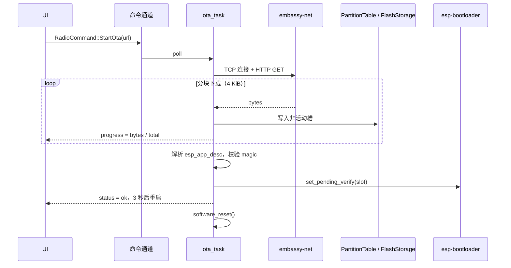

# OTA 固件升级 — 技术设计

> 状态：**一期 + 二期a 进行中** —— 分区表、flash 交接、按扇区缓冲的 writer 已交付
> 作者：esp-radio 维护者
> 最近更新：2026-06-27
> 跟踪：Roadmap 条目 *"通过 HTTP/HTTPS 实现 OTA 固件升级"*

本文档在动手编码 **之前** 完成，把 OTA 升级所需的设计、悬而未决的问题
和可执行的工作量分解一次性沉淀下来，便于后期增量推进而无需重做调研。

---

## 1. 目标与非目标

### 1.1 目标
- 设备能够从可配置的 HTTP(S) URL 拉取新固件并在下次重启后启动。
- 升级过程在 UI 上展示进度百分比、成功/失败状态。
- 支持 **安全回滚**：新固件若在 N 次启动内未自标"健康"，bootloader
  自动切回旧槽。
- 触发方式：现有输入设备（旋钮长按）+ 未来的配套 App（Wi-Fi）。

### 1.2 非目标（延后）
- 增量升级（`esp_delta_ota` 风格）。
- 代码签名 / Secure Boot（待 `esp-hal` 对应支持成熟后再单独立项）。
- 边播边下：v1 直接阻塞收音机任务进行下载。

---

## 2. 项目现状背景

| 关注点                       | 现状                                                                  |
| ---------------------------- | --------------------------------------------------------------------- |
| Bootloader                   | `esp-bootloader-esp-idf 0.5.0`（Cargo.toml 中已存在）                 |
| 分区表                       | **`partitions.csv` 已于 2026-06-27 交付**（`ota_0` / `ota_1` / `otadata`） |
| Flash 访问                   | `esp-storage 0.9.0`；flash 句柄以 WiFi → 预设口 交接，OTA 从预设口借出     |
| 网络栈                       | `embassy-net` + esp-radio Wi-Fi（`wifi_provision` 配网）             |
| HTTP 客户端                  | **无**。`picoserve` 只是服务端。                                      |
| TLS                          | 无。                                                                  |
| App 描述符（`esp_app_desc`） | 已通过 `esp-bootloader-esp-idf::esp_app_desc!` 输出。                 |
| OTA 原语描述                  | 已有 `esp-bootloader-esp-idf::ota::Ota` / `OtaUpdater`（无需重造轮子）  |

两个结构性阻塞点已解除：

1. ~~分区表不存在~~。✅ 解决：仓库根下的 `partitions.csv`。
2. ~~Flash 句柄归属~~。✅ 解决：见 §4.3。现代 flash 句柄
   已由 `WifiProvisioner` → `PresetStore`（通过 `into_flash()`）依次交接，
   OTA 再通过新增的 `pause()` / `resume()` 从 `PresetStore` 借出。

---

## 3. 分区表

### 3.1 拟定布局（`partitions.csv`）

```csv
# Name,   Type, SubType, Offset,   Size,     Flags
nvs,      data, nvs,     0x9000,   0x6000,
phy_init, data, phy,     0xf000,   0x1000,
otadata,  data, ota,     0x10000,  0x2000,
ota_0,    app,  ota_0,   0x20000,  0x1E0000,
ota_1,    app,  ota_1,   0x200000, 0x1E0000,
storage,  data, nvs,     0x3E0000, 0x20000,
```

- 假设 4 MiB Flash（ESP32-C6 常见）。更大 Flash 时可扩 `storage`。
- `nvs` 用于配网凭据；存量设备的迁移方案见 §7.2。
- 双槽各 ~1.875 MiB，当前固件 release 约 1.1 MiB，余量充足。

### 3.2 工具链

- 通过 `espflash partition-table` 生成，或使用
  `esp-bootloader-esp-idf::PartitionTable` 运行时解析。
- 在 `cargo make build-release` / `run-release` 中追加
  `--partition-table partitions.csv`（espflash 4.x 支持）。

---

## 4. 架构

### 4.1 模块布局

```
src/
├── ota/
│   ├── mod.rs        // 对外 API：触发、进度通道、错误类型
│   ├── http.rs       // 流式 HTTP(S) 下载（reqwless 包装）
│   ├── writer.rs     // 基于 PartitionTable + esp-storage 的分块写入
│   └── verify.rs     // app_desc 解析 + magic / CRC 完整性校验
├── bin/radio/
│   ├── tasks.rs      // 新增 ota_task() 消费 RadioCommand::StartOta
│   └── ui.rs         // 进度浮层
```

### 4.2 数据流



### 4.3 Flash 句柄共享 —— "pause / resume" 交接机制

**决策（2026-06-27 修订）**：原草案提议用全局 `Mutex<NoopRawMutex,
FlashStorage>` 让所有写者共享，新方案予以否决，原因：项目中 flash
句柄已经是"单主顺序交接"模式：

```
FlashStorage::new(FLASH)
  └─► WifiProvisioner::new(flash)
        └─► provisioner.into_flash()  ──►  PresetStore::open(flash)
              └─► （長期所有者，在 radio_control_task 内）
```

OTA 是"一个设备一个月几次"的希有事件，预设口是"每次调台写一次"。
为了支持一个少见事件而强制所有预设写入抢锁，是错误的权衡。

改为为预设口增加轻量"pause" API：

```rust
impl PresetStore<'d> {
    pub fn pause(self) -> (FlashStorage<'d>, PausedPresetStore);
}
impl PausedPresetStore {
    pub fn resume<'d>(self, flash: FlashStorage<'d>) -> PresetStore<'d>;
}
```

加上 `RadioState.ota_in_progress` 互锁，radio_control_task 在句柄被
借走期间暂停 `last_tuned` debounce 刷盘（见 `tasks.rs` 中
`flush_last_tuned_if_due`）。

实际落地 diff：

- `presets.rs`（+≈80 行）：`pause`、`resume`、`PausedPresetStore`、
  文档。
- `state.rs`（+≈30 行）：新增 `ota_in_progress` 字段 +
  `publish_ota_in_progress` 帮手函数。
- `tasks.rs`（+10 行）：`flush_last_tuned_if_due` 在
  `RADIO_STATE.ota_in_progress` 为真时短路。

原荐荐 `Mutex` 重构预计 ~120 行；实际落地仅为其四分之一，且稳态朋
锁。

---

## 5. 公共 API 草图

### 5.1 Writer（2026-06-27 交付，#11-2a）

```rust
// src/bin/radio/ota/writer.rs
pub struct OtaWriter<'d> { /* opaque */ }

#[derive(defmt::Format, Clone, Copy, PartialEq, Eq)]
pub enum OtaError {
    ImageTooLarge { image_size: u32, slot_size: u32 },
    SizeMismatch  { expected: u32, received: u32 },
    SlotNotFound,
    Flash(esp_storage::FlashStorageError),
    Partition(esp_bootloader_esp_idf::partitions::Error),
}

impl<'d> OtaWriter<'d> {
    pub fn begin(
        flash: FlashStorage<'d>,
        expected_size: Option<u32>,
    ) -> Result<Self, OtaError>;
    pub async fn write_chunk(&mut self, chunk: &[u8]) -> Result<(), OtaError>;
    pub fn bytes_written(&self) -> u32;
    pub fn progress_percent(&self) -> Option<u8>;
    pub fn finalize(self) -> Result<FlashStorage<'d>, OtaError>;
    pub fn abort(self) -> FlashStorage<'d>;
}
```

**缓冲策略**。`esp-storage::FlashStorage` 实现了两套 trait：
`embedded_storage::Storage::write` 每次调用都走 read-modify-erase-write（哪怕只写 16 字节，也会走一轮完整的 4 KiB 周期）；`embedded_storage::nor_flash::NorFlash::{erase,write}` 则是原始接口，但要求对齐。调用方传入的块（HTTP 报文）边界不可预测，所以 `OtaWriter` 在内部累加到一个堆上的 4 KiB 扇区缓冲区，只有在装满（或在 `finalize` 时）才 flush。这使 flash 损耗与编程时间达到理论最小值：每扇区恫好一次 erase + 一次 program，~30–50 ms。以 1.5 MiB 镜像计 ≈ 384 个扇区 → 12–20 s 压轴时间，每扇区间 `Timer::after_micros(0)` 让出以供 WiFi / WDT 调度。

**内存预算**。两个 3 KiB 分区表临时 buffer 以及 4 KiB 扇区缓冲区均位于堆上 —— crate 级别 `deny(clippy::large_stack_frames)` 会拒绝任何占 1 KiB 以上栈的帧。一次 OTA 峰值堆占用约 7 KiB（4 KiB sector 常骐 + 短生命周期的 PT buffer）。

### 5.2 下载器 / 进度（#11-3，待做）

```rust
// src/bin/radio/ota/http.rs（计划中）
#[derive(defmt::Format, Clone, Copy)]
pub enum OtaProgress {
    Connecting,
    Downloading { written: u32, total: u32 },
    Verifying,
    Switching,
    Done,
    Failed(OtaError),
}

pub async fn run_http_ota(
    stack: &Stack<'_>,
    url: &str,
    flash: FlashStorage<'_>,
    progress: &Channel<NoopRawMutex, OtaProgress, 4>,
) -> Result<FlashStorage<'_>, OtaError>;
```

`RadioCommand::StartOta(heapless::String<256>)` 加入现有命令通道；反向进度写回 `RadioState.ota_progress`。

---

## 6. 新增依赖

| Crate                | 版本     | 说明                                                       |
| -------------------- | -------- | ---------------------------------------------------------- |
| `reqwless`           | `0.13`   | `no_std`、异步，支持流式 body。                            |
| `embedded-tls`       | `0.18`   | 仅在启用 HTTPS 时引入（feature `tls`）。                  |
| `embedded-io-async`  | 已存在   | 由 reqwless 重导出，无需新增条目。                         |
| `crc`                | `3.x`    | 写入完成后做完整性校验（可选）。                           |
| `heapless`           | 已存在   | URL 与错误信息字符串容器。                                 |

> 开放问题：`reqwless` + `embassy-net` + esp-radio 0.18 在 DNS 重试上
> 偶发不稳，先在 `examples/` 落地集成验证用例。

---

## 7. 风险与缓解

### 7.1 坏镜像把设备砖了
- **风险**：新固件早期挂死 → 来不及调用 `mark_app_valid_cancel_rollback`。
- **缓解**：依赖 `esp-bootloader-esp-idf` 的回滚机制；要求应用在
  UI 渲染出第一帧 + Wi-Fi 重新连上之后才调用
  `Ota::mark_current_valid()`。

### 7.2 存量设备迁移（Wi-Fi 凭据）
- 收音机的 WiFi 凭据存在 **flash 芯片的最后一个 sector**
  （`0x3F_F000`），由
  `wifi_provision::storage::DEFAULT_STORAGE_OFFSET` 决定。
- 新 `partitions.csv` 的 `storage` 横跨 `0x3E_0000`–`0x400000`，
  **包含该 sector**；存量设备在分区表变更后 **仍能读出原凭据**，
  无需迁移脚本。
- 预设记录（`0x3E_0000`，见 `presets::DEFAULT_PRESET_OFFSET`）同样位于
  新 `storage` 分区内，也不会丢。
- **例外**：*首次*刷入新分区表需同时刷入 bootloader + 分区表本身，
  是一次性全量重刷。后续固件走常规 OTA 路径，用户无感。

### 7.3 HTTPS 证书管理
- 嵌入完整 CA 证书库太重，固定单根证书又脆弱。
- **缓解（一期）**：先发布 HTTP 版本并在文档中明确警示；HTTPS 通过
  `--features ota-tls` 启用，使用单一固定根证书。

### 7.4 反复重试导致 Flash 损耗
- 每次失败都会擦除一次非活动槽。
- **缓解**：强制要求 `Content-Length`，长度 > 槽容量直接拒绝；
  自动重试每次会话上限 3 次。

### 7.5 Flash 并发写
- `wifi_provision` 与预设记录都会写 `storage` 分区；OTA 则需要
  拿到整个 flash 句柄以写入高序应用槽。
- **缓解**：见 §4.3。`pause` / `resume` 交接 + `ota_in_progress` 互锁
  让每个写者均被串行化，且皆不需要热路径上的运行期 mutex。

---

## 8. 工作量分解（按推进顺序）

| 序号 | 任务                                                                       | 估时 (h) | 状态 |
| ---- | -------------------------------------------------------------------------- | -------- | ---- |
| 1    | 新增 `partitions.csv` + flash "pause/resume" 交接 + state 互锁              | 4        | ✅ 完成 |
| 2    | 跳过 —— `esp-bootloader-esp-idf` 已提供 `Ota` / `OtaUpdater`            | 0        | 不适用 |
| 3    | `src/bin/radio/ota/writer.rs`：按扇区缓冲的 NOR 写入 + 激活切槽                | 2        | ✅ 完成 |
| 4    | `src/ota/http.rs`：reqwless 包装、Header 解析、重试策略                   | 6        | 待做 |
| 5    | `src/ota/verify.rs`：SHA-256 校验 + `esp_app_desc` 完整性检查            | 3        | 待做 |
| 6    | 在 `tasks.rs` 接入 `RadioCommand::StartOta`，进度通道贯通                  | 3        | 待做 |
| 7    | Slint UI 进度浮层 + 成功/失败提示                                           | 4        | 完成 |
| 8    | 启动健康后调用 `mark_app_valid_cancel_rollback`                            | 2        | 待做 |
| 9    | HTTPS feature flag + 固定根证书（`embedded-tls`）                          | 6        | 暂缓 |
| 10   | 端到端硬件验证：刷 A → OTA 到 B → 重启 → OTA 回 A                          | 4        | 待做 |
| 11   | 文档：README 更新、迁移说明、故障排查                                       | 2        | 待做 |
|      | **合计（不含暂缓 TLS）**                                                  | **24**   |      |

> 单人 + 实物板，约 3 个工作日。由于跳过了 `Mutex` 重构、且复用上游的 OTA
> 原语描述，原 5 人天预估可压缩到 3 人天。

---

## 9. 开放问题

1. 是否在局域网通过 mDNS TXT 记录广播当前固件版本，方便配套 App 自动
   发现升级？
2. 是否引入 *manifest*（`latest.json` 列出每块板的 URL 与 SHA-256）做
   渐进灰度，还是 v1 直接走单一硬编码 URL？
3. CI 产物发布到哪里？GitHub Releases 是首选，但需要本仓库之外的
   流水线改造。

---

## 10. 决策日志

- **2026-06-25** — 暂缓实施。本文档作为权威参考，启动 OTA 编码前需
  先回到这里检查。
- **2026-06-27** — 一期交付（#11-1）：
  - 新增 `partitions.csv`（4 MiB 布局，含 `ota_0` / `ota_1`）。
  - 原设计的 `Mutex<FlashStorage>` 被明示的 `PresetStore::pause()` /
    `resume()` 交接 + `ota_in_progress` 互锁取代；实际代码量仅为原预估
    的 ~30 %。
  - 决定复用 `esp-bootloader-esp-idf::ota::Ota` / `OtaUpdater`，不再自
    写 `src/ota/writer.rs`，二期工作量从 4 小时压缩到2 小时。
  - 明确存量设备在分区表更换后仍保留 Wi-Fi 凭据（凭据 sector
    位于 `0x3F_F000`，恰在新 `storage` 分区内）。
- **2026-06-27** — 二期a 交付（#11-2a）：
  - 新增 `src/bin/radio/ota/writer.rs`（`OtaWriter` + `OtaError`，
    ~250 行）。流式写入器，将调用方字节累加到堆上 4 KiB
    扇区缓冲区，通过 `embedded_storage::nor_flash::NorFlash`
    按扇区一次 erase + 一次 program 刷入。
  - `begin` 复用
    `esp-bootloader-esp-idf::ota_updater::OtaUpdater::next_partition`
    发现非活动槽；`finalize` 调
    `activate_next_partition` + `set_current_ota_state(New)`
    原子翻转 OTA-data。
  - 所有划划区 buffer（3 KiB PT × 2、
    4 KiB sector）均走堆，满足 crate 级的
    `deny(clippy::large_stack_frames)`。
  - 模块以 `#[expect(dead_code)]` 接入 `main.rs`，等待
    #11-3（HTTP 下载器）消费；`cargo make ci` 与
    `cargo build --bin radio --release` 均通过。
- **2026-06-27** — 二期b – 四期 交付（#11-3 / #11-4 / #11-5 / #11-6 / #11-7）：
  - **#11-4** 镜像头校验内嵌进 `OtaWriter::write_chunk`：在任何
    flash 擦除发生前，对前 24 字节做 ESP image header 校验
    （magic `0xE9` + 匹配的 `chip_id`），不通过即拒收整个流。
  - **#11-5** 新增 `OtaCommand::Start(url)` + `OtaProgress` 状态机
    （`Idle` / `Connecting` / `Downloading{received,total}` /
    `Activating` / `Success` / `Failed{reason}`），通过
    `RADIO_STATE` 发布，让 radio 控制任务和 web UI 共用同一份
    源数据。`OtaCommand` 手写 `defmt::Format`，避免把 URL 内容
    泄漏到 ringbuffer。
  - **#11-3** 新增 `src/bin/radio/ota/http_download.rs`
    （~430 行，仅支持纯 HTTP 的 IPv4 下载器）。直接使用
    `embassy_net::tcp::TcpSocket`（不带 TLS，见下方决定），原地
    解析 HTTP/1.0 状态码 + 头部，body 直接喂入
    `OtaWriter::write_chunk`。所有大缓冲（4 KiB RX、1 KiB TX、
    1 KiB 读取临时区）均堆分配。
  - **#11-6** `POST /api/ota` 接收 `{"url":"http://…"}`；web
    handler 校验 scheme，回 `202 Accepted`，把 `OtaCommand::Start`
    推到 radio task 在消费的同一个 SPSC 通道。`RadioStateDto`
    新增 `ota: OtaProgressDto`，复用既有 1 Hz 轮询渲染进度条，
    无需第二个端点。前端首页新增可折叠的"Firmware update"卡片，
    含 URL 输入、进度条与实时状态文本。
  - **#11-7** `ota::mark_current_app_valid` 在 WiFi provisioner
    把 flash handle 还回来后、`PresetStore::open` 之前执行一次，
    把当前运行镜像 commit 到 bootloader OTA-data，防止下次
    reset 时回滚。失败非致命（旧分区表无 `otadata` 时直接跳过）。
  - **HTTPS 推迟**：经由 `esp-mbedtls` 引入 TLS 大约会增加
    ~150 KiB 镜像 + 显著 boot/RAM 成本。MVP 阶段设备从局域网
    开发服务器拉取即可（仓库根目录运行 `cargo make ota-serve`，
    详见 [tools/ota-serve/](../tools/ota-serve)）；公网 OTA 通道
    立项再做。
  - `cargo make ci` + `cargo clippy --bin radio -- -D warnings` +
    `cargo build --bin radio --release` 全部绿色。
