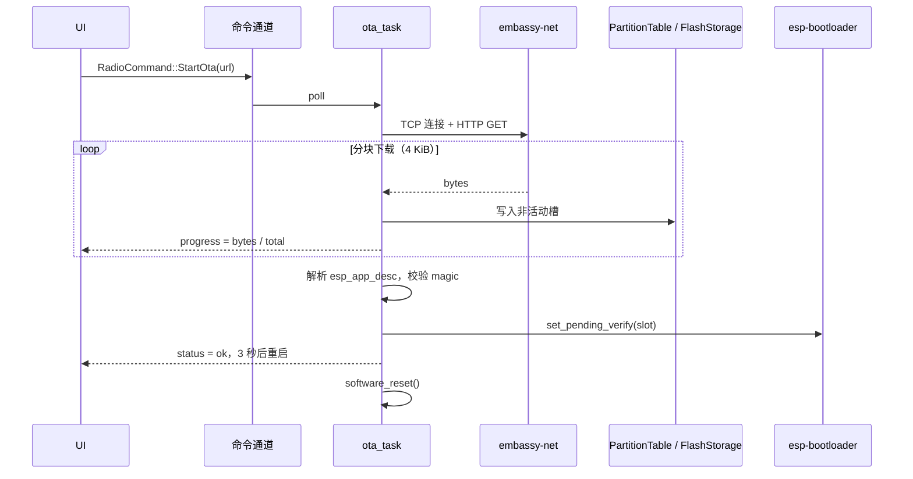

# OTA 固件升级 — 技术设计

> 状态：**草案（实施暂缓）**
> 作者：esp-radio 维护者
> 最近更新：2026-06-25
> 跟踪：Roadmap 条目 *"通过 HTTP/HTTPS 实现 OTA 固件升级"*

本文档在动手编码 **之前** 完成，把 OTA 升级所需的设计、悬而未决的问题
和可执行的工作量分解一次性沉淀下来，便于后期增量推进而无需重做调研。

---

## 1. 目标与非目标

### 1.1 目标
- 设备能够从可配置的 HTTP(S) URL 拉取新固件并在下次重启后启动。
- 升级过程在 UI 上展示进度百分比、成功/失败状态。
- 支持 **安全回滚**：新固件若在 N 次启动内未自标"健康"，bootloader
  自动切回旧槽。
- 触发方式：现有输入设备（旋钮长按）+ 未来的配套 App（Wi-Fi）。

### 1.2 非目标（延后）
- 增量升级（`esp_delta_ota` 风格）。
- 代码签名 / Secure Boot（待 `esp-hal` 对应支持成熟后再单独立项）。
- 边播边下：v1 直接阻塞收音机任务进行下载。

---

## 2. 项目现状背景

| 关注点                       | 现状                                                                  |
| ---------------------------- | --------------------------------------------------------------------- |
| Bootloader                   | `esp-bootloader-esp-idf 0.5.0`（Cargo.toml 中已存在）                 |
| 分区表                       | **espflash 默认 `single-app`**（无 `ota_0` / `ota_1` / `otadata`）   |
| Flash 访问                   | `esp-storage 0.9.0`，`FlashStorage` 单例归 `WifiProvisioner` 所有    |
| 网络栈                       | `embassy-net` + esp-radio Wi-Fi（`wifi_provision` 配网）             |
| HTTP 客户端                  | **无**。`picoserve` 只是服务端。                                      |
| TLS                          | 无。                                                                  |
| App 描述符（`esp_app_desc`） | 已通过 `esp-bootloader-esp-idf::esp_app_desc!` 输出。                 |

两个结构性阻塞点：

1. **分区表不存在**：单 app 槽，无法承载双槽 OTA。
2. **Flash 句柄归属**：`FlashStorage::new(peripherals.FLASH)` 已被
   `WifiProvisioner::new()` 取走且不释放，OTA 需要再借用同一个 `FLASH` 外设。

---

## 3. 分区表

### 3.1 拟定布局（`partitions.csv`）

```csv
# Name,   Type, SubType, Offset,   Size,     Flags
nvs,      data, nvs,     0x9000,   0x6000,
phy_init, data, phy,     0xf000,   0x1000,
otadata,  data, ota,     0x10000,  0x2000,
ota_0,    app,  ota_0,   0x20000,  0x1E0000,
ota_1,    app,  ota_1,   0x200000, 0x1E0000,
storage,  data, nvs,     0x3E0000, 0x20000,
```

- 假设 4 MiB Flash（ESP32-C6 常见）。更大 Flash 时可扩 `storage`。
- `nvs` 用于配网凭据；存量设备的迁移方案见 §7.2。
- 双槽各 ~1.875 MiB，当前固件 release 约 1.1 MiB，余量充足。

### 3.2 工具链

- 通过 `espflash partition-table` 生成，或使用
  `esp-bootloader-esp-idf::PartitionTable` 运行时解析。
- 在 `cargo make build-release` / `run-release` 中追加
  `--partition-table partitions.csv`（espflash 4.x 支持）。

---

## 4. 架构

### 4.1 模块布局

```
src/
├── ota/
│   ├── mod.rs        // 对外 API：触发、进度通道、错误类型
│   ├── http.rs       // 流式 HTTP(S) 下载（reqwless 包装）
│   ├── writer.rs     // 基于 PartitionTable + esp-storage 的分块写入
│   └── verify.rs     // app_desc 解析 + magic / CRC 完整性校验
├── bin/radio/
│   ├── tasks.rs      // 新增 ota_task() 消费 RadioCommand::StartOta
│   └── ui.rs         // 进度浮层
```

### 4.2 数据流



### 4.3 Flash 句柄共享

最干净的方案：在 `main` 中持有 **唯一的静态 `FlashStorage`**，外部通过
`embassy_sync::mutex::Mutex<NoopRawMutex, FlashStorage>` 共享借用。
`wifi_provision` 与 `ota` 协作访问。

需要重构的接口：

- `WifiProvisioner::new(flash, …)` → `WifiProvisioner::new(flash_mutex, …)`。
- `wifi_provision::storage::CredentialStorage` 由"拥有"改为"借用"
  `&Mutex<NoopRawMutex, FlashStorage>`。
- `ota::Updater::new(flash_mutex, partitions)` 共用同一句柄。

预估 diff：~120 行，集中在 `wifi_provision/{mod,storage}.rs` 与
`bin/radio/main.rs`。

---

## 5. 公共 API 草图

```rust
// src/ota/mod.rs
pub struct OtaUpdater<'a> {
    flash: &'a Mutex<NoopRawMutex, FlashStorage>,
    pt:    PartitionTable<'static>,
}

#[derive(defmt::Format)]
pub enum OtaError {
    Connect, Http(u16), Truncated, BadMagic,
    AppDescMismatch { found: heapless::String<32> },
    Flash, NoFreeSlot,
}

#[derive(defmt::Format, Clone, Copy)]
pub enum OtaProgress {
    Connecting,
    Downloading { written: u32, total: u32 },
    Verifying,
    Switching,
    Done,
    Failed(OtaError),
}

impl<'a> OtaUpdater<'a> {
    pub async fn run(
        &mut self,
        stack: &Stack<'_>,
        url: &str,
        progress: &Channel<NoopRawMutex, OtaProgress, 4>,
    ) -> Result<(), OtaError> { /* … */ }
}
```

`RadioCommand::StartOta(heapless::String<256>)` 加入现有命令通道；
反向进度写回 `RadioState.ota_progress`。

---

## 6. 新增依赖

| Crate                | 版本     | 说明                                                       |
| -------------------- | -------- | ---------------------------------------------------------- |
| `reqwless`           | `0.13`   | `no_std`、异步，支持流式 body。                            |
| `embedded-tls`       | `0.18`   | 仅在启用 HTTPS 时引入（feature `tls`）。                  |
| `embedded-io-async`  | 已存在   | 由 reqwless 重导出，无需新增条目。                         |
| `crc`                | `3.x`    | 写入完成后做完整性校验（可选）。                           |
| `heapless`           | 已存在   | URL 与错误信息字符串容器。                                 |

> 开放问题：`reqwless` + `embassy-net` + esp-radio 0.18 在 DNS 重试上
> 偶发不稳，先在 `examples/` 落地集成验证用例。

---

## 7. 风险与缓解

### 7.1 坏镜像把设备砖了
- **风险**：新固件早期挂死 → 来不及调用 `mark_app_valid_cancel_rollback`。
- **缓解**：依赖 `esp-bootloader-esp-idf` 的回滚机制；要求应用在
  UI 渲染出第一帧 + Wi-Fi 重新连上之后才调用
  `Ota::mark_current_valid()`。

### 7.2 存量设备迁移（NVS 偏移变化）
- 当前默认分区表的 NVS 偏移与新分区表不一致，首次刷入 OTA 版固件后
  原配网信息不可读。
- **缓解**：新增 `cargo make migrate-flash` 任务，刷写前先擦除 NVS；
  在 changelog 中明确"一次性重新配网"的步骤。

### 7.3 HTTPS 证书管理
- 嵌入完整 CA 证书库太重，固定单根证书又脆弱。
- **缓解（一期）**：先发布 HTTP 版本并在文档中明确警示；HTTPS 通过
  `--features ota-tls` 启用，使用单一固定根证书。

### 7.4 反复重试导致 Flash 损耗
- 每次失败都会擦除一次非活动槽。
- **缓解**：强制要求 `Content-Length`，长度 > 槽容量直接拒绝；
  自动重试每次会话上限 3 次。

### 7.5 Flash 并发写
- OTA 进行时 `wifi_provision` 可能也要写入凭据。
- **缓解**：§4.3 的 `Mutex<FlashStorage>` 强制串行；OTA 每次只在
  写入一个 ~4 KiB chunk 时持锁，保证配网写入仍可及时穿插。

---

## 8. 工作量分解（按推进顺序）

| 序号 | 任务                                                                       | 估时 (h) |
| ---- | -------------------------------------------------------------------------- | -------- |
| 1    | 新增 `partitions.csv`，在 `Makefile.toml` 串联 espflash 参数              | 2        |
| 2    | 重构 `FlashStorage` 归属为共享 `Mutex`（含 provisioner 改造）             | 4        |
| 3    | `src/ota/writer.rs`：感知分区的分块写入 + 单元测试                         | 4        |
| 4    | `src/ota/http.rs`：reqwless 包装、Header 解析、重试策略                   | 6        |
| 5    | `src/ota/verify.rs`：`esp_app_desc` 解析、magic / CRC 校验                | 3        |
| 6    | 在 `tasks.rs` 接入 `RadioCommand::StartOta`，进度通道贯通                  | 3        |
| 7    | Slint UI 进度浮层 + 成功/失败提示                                           | 4        |
| 8    | 启动健康后调用 `mark_app_valid_cancel_rollback`                            | 2        |
| 9    | HTTPS feature flag + 固定根证书（`embedded-tls`）                          | 6        |
| 10   | 端到端硬件验证：刷 A → OTA 到 B → 重启 → OTA 回 A                          | 4        |
| 11   | 文档：README 更新、迁移说明、故障排查                                       | 2        |
|      | **合计**                                                                    | **40**   |

> 单人 + 实物板，约 5 个工作日。

---

## 9. 开放问题

1. 是否在局域网通过 mDNS TXT 记录广播当前固件版本，方便配套 App 自动
   发现升级？
2. 是否引入 *manifest*（`latest.json` 列出每块板的 URL 与 SHA-256）做
   渐进灰度，还是 v1 直接走单一硬编码 URL？
3. CI 产物发布到哪里？GitHub Releases 是首选，但需要本仓库之外的
   流水线改造。

---

## 10. 决策日志

- **2026-06-25** — 暂缓实施。本文档作为权威参考，启动 OTA 编码前需
  先回到这里检查。
